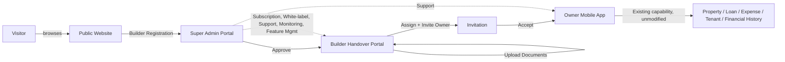
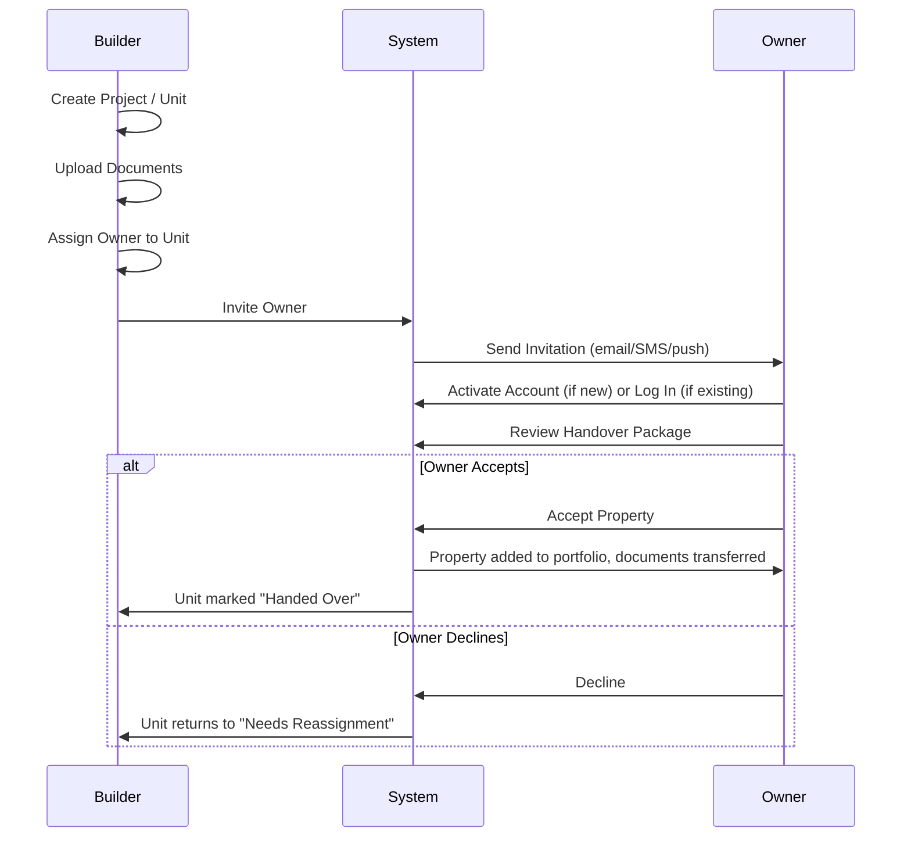
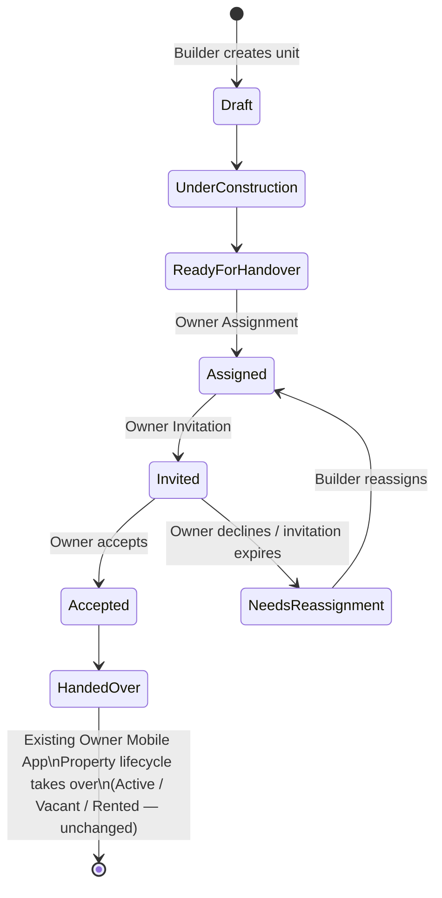

---

## Document Information

| Field | Value |
|---|---|
| **Document ID** | A-002 |
| **Document Name** | Business Flow |
| **Project** | MyPropertyAsset Web Platform |
| **Version** | 1.0 |
| **Status** | Draft |
| **Prepared By** | Enterprise Architecture Team (Enterprise Solution Architect / SaaS Product Architect / Business Architect / UI-UX Architect / Database Architect / Security Architect) |
| **Target AI** | Claude AI (Opus / Sonnet) |
| **Created Date** | 2026-07-09 |
| **Updated Date** | 2026-07-09 |
| **Dependencies** | A-001 Product Vision & Scope |
| **Referenced Documents** | `A-001-product-vision-scope.md`; backend: `PLATFORM_FOUNDATION_SPECIFICATION.md`, `docs/ies/*` |
| **Previous Document** | A-001 Product Vision & Scope |
| **Next Document** | A-003 User Journey |
| **Related ADR** | None yet (this document introduces no technical decision — see §24) |
| **Approval Status** | Pending approval |

---

# A-002 — Business Flow

## Pre-Check Result

A-001 was read in full and is treated as source of truth; nothing in it is modified or contradicted below. No ADR documents exist to read (confirmed in A-001's Architecture Index). One item from A-001 is *advanced*, not contradicted: A-001 §14 left open whether "Builder" and the backend's "Organization" are the same construct. Working through the Super Admin Portal's business processes below (§7) makes the answer concrete — see §16's Organization Rules for the resolution, framed as a narrowing of the open question, not a reversal of anything A-001 stated.

---

## 1. Executive Summary

This document defines how the MyPropertyAsset Web Platform operates as a business, end to end: how a builder becomes a platform participant, how a property moves from a builder's project into an owner's hands, and how the existing Owner Mobile App fits into that flow without any change to its own internals. It is a process document — actors, roles, flows, lifecycles, and rules — with no technical design content. Everything here is what A-003 (User Journey), A-004 (Screen Flow), NG-001 (Angular Architecture), and the API/security documents that follow will implement against.

## 2. Business Actors

| Actor | Description |
|---|---|
| **Visitor** | An unauthenticated person browsing the Public Website |
| **Prospective Builder** | A visitor who has submitted a Builder Registration, not yet approved |
| **Builder** | An approved organization operating the Builder Handover Portal |
| **Builder Team Member** | A user acting within a Builder's organization (not every builder interaction requires a single "the builder" identity — team membership is assumed at business level, detailed roles are §3) |
| **Property Owner** | A user of the Owner Mobile App, existing or newly onboarded via handover |
| **Tenant** | Exists today within the Owner Mobile App's existing scope; referenced, not redesigned |
| **Platform Operator** | MyPropertyAsset's own staff, operating the Super Admin Portal |
| **System** | The platform itself, as the actor responsible for automated notifications, invitation tokens, and state transitions |

## 3. Business Roles

| Role | Surface | Authority |
|---|---|---|
| Builder Organization Admin | Builder Handover Portal | Full control within their own builder organization: projects, units, invitations, documents, team, settings |
| Builder Team Member | Builder Handover Portal | Scoped operational access within their organization (exact scope is an authorization design question for a future Security document, not decided here) |
| Property Owner | Owner Mobile App | Full control of their own properties, tenants, expenses, loans, documents — entirely the existing, unmodified role |
| Super Admin | Super Admin Portal | Full platform authority: approve/suspend builders, configure white-label, manage subscriptions, manage features, support |
| Support Operator | Super Admin Portal | A narrower Super Admin capacity focused on support tooling — named here as a role because the Super Admin Portal's scope (§Business Flow Scope) separates "Support" from "Builder Approval"/"Subscription," implying not every Super Admin action needs full platform authority; the precise boundary is a future authorization design decision |

## 4. Business Processes

The platform's business operates as five linked processes:

1. **Acquisition** — Public Website → lead capture / builder registration submission.
2. **Builder Onboarding** — registration review → approval → organization + portal access provisioned.
3. **Project & Handover Preparation** — builder creates projects/units, uploads documents, assigns prospective owners.
4. **Owner Onboarding & Handover** — owner is invited, activates an account, reviews and accepts a property.
5. **Ongoing Property Management** — everything after handover is the existing Owner Mobile App experience, unmodified.

Platform Operations (subscription, white-label, support, monitoring, feature management) runs alongside all five as a standing, not sequential, process.

## 5. Platform Business Flow



## 6. Public Website Flow

| Step | Description |
|---|---|
| Visitor Journey | Landing → browse product/pricing information → a call to action (sign up, request demo, contact sales, or register as a builder) |
| Builder Registration | A prospective builder submits company/contact information. This creates a **pending** registration — it does not create platform access. Access is granted only through Super Admin approval (§7) |
| Contact Sales | Lead capture routed to MyPropertyAsset's own commercial process — external to the platform, not a CRM feature the platform itself provides (distinct from the Builder Portal's permanent exclusion of CRM for a *builder's own* customers, §16) |
| Request Demo | Lead capture, same routing as Contact Sales |
| Pricing Inquiry | Lead capture, same routing |
| Support | Public, unauthenticated support/contact surface — distinct from the authenticated in-app support available to Builders and Owners |

## 7. Super Admin Flow

| Step | Description |
|---|---|
| Builder Registration (review) | Platform Operator reviews a Prospective Builder's submission |
| Builder Approval | Approve → creates the Builder's Organization (platform tenant) and provisions Builder Handover Portal access for their initial admin user, who then goes through account activation (mirroring the Owner activation flow, §9). Reject → Prospective Builder is notified with a reason and may reapply (§15) |
| Organization Setup | Formalizing the approved Builder's Organization record — see §16 Organization Rules for what "Organization" means here relative to A-001 |
| Subscription | Assign/manage the Builder's platform subscription/plan |
| White-label Configuration | Configure the approved Builder's branding for their Builder Portal presentation (vision-level only — no mechanism designed, per A-001 §13) |
| User Management | Manage users across all roles platform-wide (support/operations function) |
| Support | Internal tooling for handling Builder and Owner support requests |
| Monitoring | Platform usage/health visibility at a business level (not a technical/APM design) |
| Feature Management | Enable/disable platform features per Organization — e.g., a Builder Organization may not yet have Reports enabled |

## 8. Builder Portal Flow

| Step | Description |
|---|---|
| Builder Login | Authenticated, scoped to the Builder's own Organization |
| Dashboard | Summary of the Builder's projects, units, and handover progress |
| Project Management | Create/manage construction projects — this is the business-process counterpart of the backend's **Builder Projects domain, which the Stage 4 Database Review found has no design or implementation yet.** This document's Project Management flow is exactly the business requirement that domain will need to satisfy — flagged here as a concrete forward dependency, not solved by this document |
| Unit Management | Individual units/properties within a project |
| Owner Assignment | Link a specific unit to a specific prospective owner (a data link based on the builder's own sales records, which live outside the platform — the Builder Portal never becomes the system of record for the sale itself, consistent with the CRM/Sales exclusion, §16) |
| Owner Invitation | Invite the assigned owner (detailed in §11) |
| Document Upload | Upload handover-relevant documents (sale deed, building plan, possession certificate, warranty, etc.) against a unit |
| Property Handover | The formal transfer event (detailed in §10) |
| Notification | Builder-side notifications for invitation status and handover milestones |
| Reports | Builder-level reporting on handover progress across projects/units (business-level; no report design here) |
| Settings | Builder Organization profile and team member management |
| Builder Logout | — |

## 9. Owner Flow

| Step | Description |
|---|---|
| Invitation | Owner receives an invitation from a Builder (§11), **or** signs up directly through the existing self-serve flow — both paths are equally valid entry points, this document does not make handover the only way to become an owner |
| Account Activation | Standard account activation (Supabase Auth), which — per the existing backend design — also auto-provisions the owner's own personal Organization, entirely independent of any Builder Organization |
| Property Acceptance | Owner reviews the handover package for their assigned unit and accepts or declines it (§10) |
| Document Access | Once accepted, handover documents are accessible through the owner's existing Property Documents capability — the same documents, not a copy (§13) |
| Property Management, Loan Management, Expense Management, Tenant Management, Financial History, Notifications, Profile, Settings | All existing Owner Mobile App capability, entirely unmodified by this initiative. The only new thing is that a property can now *originate* from a handover instead of only manual entry — everything downstream is unchanged |

## 10. Property Handover Flow



## 11. Owner Invitation Flow

1. Builder selects a unit and enters the prospective owner's email (or phone).
2. System generates an invitation — token-based, time-limited, mirroring the invitation pattern already established for the backend's own Organization membership (`organization_invitations`, per `PLATFORM_FOUNDATION_SPECIFICATION.md`), though this is a **different relationship** (a builder inviting an owner to claim a property, not inviting a user into the builder's own organization).
3. Owner receives the invitation.
4. If the owner has no account: signup + account activation. If they do: login.
5. Owner reviews the specific property/unit handover package.
6. Owner accepts or rejects (§10, §15 for the reject path).
7. On acceptance, the unit's assignment is finalized and cannot be re-invited to a different owner without an explicit builder-side reassignment action.

## 12. Property Lifecycle



Everything from **Handed Over** onward is the existing Property domain's own lifecycle, untouched by this document. Everything before it is new business process, corresponding to the not-yet-designed Builder Projects backend domain (§8).

## 13. Document Lifecycle

```mermaid
flowchart LR
    Upload[Builder uploads document] --> Pending[Builder-owned, Owner-pending\n(not yet visible to owner)]
    Pending --> Handover{Property Handover accepted?}
    Handover -->|Yes| Transfer[Ownership transfers to Owner\nSame document, not a copy]
    Handover -->|No| Pending
    Transfer --> OwnerVault[Owner's existing Property Documents vault]
    Transfer -.->|Builder retains read-only historical reference for own reporting| BuilderRecord[Builder Reports]
```

Document ownership **transfers**, it does not duplicate — the same principle this platform already applies to financial data (Expense/Loan/Financial Ledger each own their data exactly once; nothing copies another domain's record). The builder's post-handover visibility is a read-only historical reference for their own reporting, not a second live copy.

## 14. Notification Flow

| Trigger | Recipient |
|---|---|
| Builder registration submitted | Platform Operator (review needed) |
| Builder approved / rejected | Builder |
| Owner invited | Owner |
| Owner accepted / declined | Builder |
| Invitation expiring / expired | Builder (so they can resend or reassign) |
| Property handover complete | Owner and Builder |
| Existing in-app triggers (EMI due, rent due, document expiry, etc.) | Owner — entirely existing capability, unaffected by this document |

## 15. Exception Flows

| Exception | Handling |
|---|---|
| Builder registration rejected | Builder notified with a reason; may reapply |
| Owner invitation expires unaccepted | Builder notified; may resend or reassign to a different owner |
| Owner declines property acceptance | Unit returns to "Needs Reassignment"; no owner-side record is created |
| Duplicate invitation for the same unit | Blocked — a unit has at most one active invitation at a time |
| Invited owner already has an account | Invitation links to the existing account; no duplicate account is created |
| Builder account suspended by Super Admin | Builder Portal access revoked immediately; **already-handed-over properties and documents are never affected** — an owner's accepted property is permanent, independent of the builder's later status |

## 16. Business Rules

| Rule | Statement |
|---|---|
| Who can create builders | Only Super Admin, via approval of a submitted Builder Registration. Builders cannot self-activate |
| Who can invite owners | Only an authorized user within an approved Builder's organization, and only for a unit already assigned to that builder's own project |
| Who owns documents | Pre-handover: the Builder's organization. Post-handover: the Owner, by transfer, not duplication (§13) |
| When ownership transfers | At the moment the Owner completes Property Acceptance — not at invitation, and not at document upload |
| When builders lose access | To a specific unit: immediately on successful handover acceptance (a read-only historical view may remain for the builder's own reporting). To the whole Builder Portal: on Super Admin suspension |
| When owners gain access | On successful Property Acceptance — account activation alone does not grant access to a specific property |
| Notification triggers | §14 |
| Property ownership rules | A unit has at most one active prospective-owner assignment at a time. Full ownership-percentage/equity modeling remains an open backend gap (already identified in the Stage 4 Database Review as an undesigned area) — not addressed by this document |
| **Organization rules (resolves A-001 §14's open question)** | "Organization" is the same generic tenant construct in both cases — a Builder's company and an Owner's personal workspace are both instances of the one Organization model already defined in `PLATFORM_FOUNDATION_SPECIFICATION.md`. What differs is population and behavior: only Builder-type Organizations go through Super Admin approval and get Builder Portal access; every Owner gets a personal Organization automatically at signup, with no approval step. **This document narrows, but does not fully close, A-001's open question** — whether the data model needs an explicit `organization_type` discriminator (or an equivalent mechanism) to express this difference is a data-model decision left to a future document (the Builder Handover Portal's domain/data architecture, or a backend follow-up to `PLATFORM_FOUNDATION_SPECIFICATION.md`) |
| White-label rules | Configured by Super Admin, applied at the Organization level, scoped to a Builder-type Organization's Builder Portal presentation. Extending white-label to an owner-facing surface is future vision only (A-001 §13), not designed here |

## 17. Cross Module Interaction

- **Public Website → Super Admin Portal:** builder registration handoff.
- **Super Admin Portal → Builder Portal:** approval grants access; suspension revokes it.
- **Builder Portal → Owner Mobile App:** invitation, property/document transfer at handover.
- **Super Admin Portal → all modules:** feature management, monitoring, and support touch every surface, standing alongside the sequential flows rather than gating them.
- **Owner Mobile App's existing capability (Expense, Loan, Tenant, Financial History):** interacts with the new modules at exactly one point — a property's origin (handover vs. manual entry). Nothing downstream of that point changes.

## 18. Risks

| Risk | Impact | Mitigation |
|---|---|---|
| Builder Projects backend domain remains undesigned while this document assumes its business requirements (§8 Project Management) | Builder Portal design work stalls waiting on a backend domain that doesn't exist yet | Flagged explicitly here as a forward dependency, consistent with how the Stage 4 Database Review already tracks this gap |
| The `organization_type` discriminator question (§16) is left open across two documents now (A-001, A-002) without a committed owner | Design drifts further before anyone actually decides it | Recommend it become the first concrete decision of whichever document designs the Builder Handover Portal's data model |
| Document "transfer, not duplication" (§13) is a business rule without a backend mechanism yet | Risk of an implementation defaulting to duplication (the easier engineering path) unless this rule is carried forward explicitly | State the rule again, verbatim if needed, in the data-architecture document that eventually designs this |
| Property ownership is modeled here as single-owner-per-unit at handover time, while the backend's Property Ownership (equity) domain is also still undesigned | A future multi-owner/co-investment scenario has two independent gaps to close, not one | Documented as a known, not-yet-addressed intersection; no action taken by this document |

## 19. Assumptions

- A-001's product portfolio, Builder Portal boundary, and role catalog are correct and stable.
- The backend's Organization/membership model (`PLATFORM_FOUNDATION_SPECIFICATION.md`) is the foundation this document's Organization rules build on, not a separate mechanism.
- "Schema V2 Approved" (per this prompt's permanent facts) is read consistently with A-001's framing: an approved target architecture, not a claim that it is fully implemented.
- The Owner Mobile App's existing capabilities (Property, Loan, Expense, Tenant, Financial History) require no change to support a handover-originated property — this is a genuine assumption, not yet verified against the actual mobile codebase, and should be confirmed before implementation.

## 20. Constraints

- No technical design (Angular, Flutter, APIs, database tables, SQL, UI components, routing, folder structure) may appear in this document.
- The Builder Portal exclusion list (CRM, Sales, HR, Payroll, Inventory, Accounting, Procurement, Society Management) is a hard constraint on every flow in §8 — none of the processes described there may grow into any of those capabilities.
- Document transfer (§13) must remain a transfer, never a duplication, as a standing constraint on future data-architecture documents.

## 21. Future Expansion

**Tenant App (future) — integration points only, no workflow designed:**
- A future Tenant Mobile App would plausibly integrate at the same two points the Owner Mobile App already does today: notification delivery and document access, scoped to the tenant's own tenancy. No further detail is given here, per this document's explicit instruction not to design future workflows.

Other named future expansion points, consistent with A-001: white-label mechanics, multi-owner property equity, and the `organization_type` discriminator decision (§16).

## 22. Summary

This document defines the platform's business flow end to end: acquisition through the Public Website, builder onboarding through the Super Admin Portal, project/unit/document management and owner invitation through the Builder Handover Portal, and property acceptance into the existing, unmodified Owner Mobile App. It establishes that document ownership transfers rather than duplicates, that a unit has at most one active owner assignment at a time, and — resolving part of A-001's open question — that "Organization" is one construct shared by both Builders and Owners, differentiated by type rather than by being two different models. It leaves the `organization_type` mechanism, the Builder Projects backend domain, and property equity modeling explicitly open for future documents, rather than deciding them here.

---

## Updated Architecture Index

See `ARCHITECTURE_INDEX.md` — updated with the A-002 entry (below). No document was overwritten; A-001 remains unmodified.

## Updated ADR List

**Not required.** This document introduces no new technical/architectural decision — it is a business-process document by design (§20 Constraints). The five anticipated ADR slots from A-001 remain undrafted.

## Review Checklist

- [ ] Business actors and roles (§2, §3) match actual organizational intent
- [ ] Organization rules resolution (§16) accepted as the correct narrowing of A-001 §14, or redirected
- [ ] Document transfer-not-duplication rule (§13) confirmed as a hard requirement for future data design
- [ ] Property lifecycle pre-handover states (§12) confirmed as the correct shape for the future Builder Projects domain
- [ ] Exception flows (§15) reviewed for completeness against real builder-suspension scenarios

## Approval Checklist

- [ ] Reviewed by Enterprise/Solution Architect
- [ ] Reviewed by Business/Product stakeholder
- [ ] Status updated from Draft to Approved in `ARCHITECTURE_INDEX.md`
- [ ] A-003 (User Journey) authorized to begin
