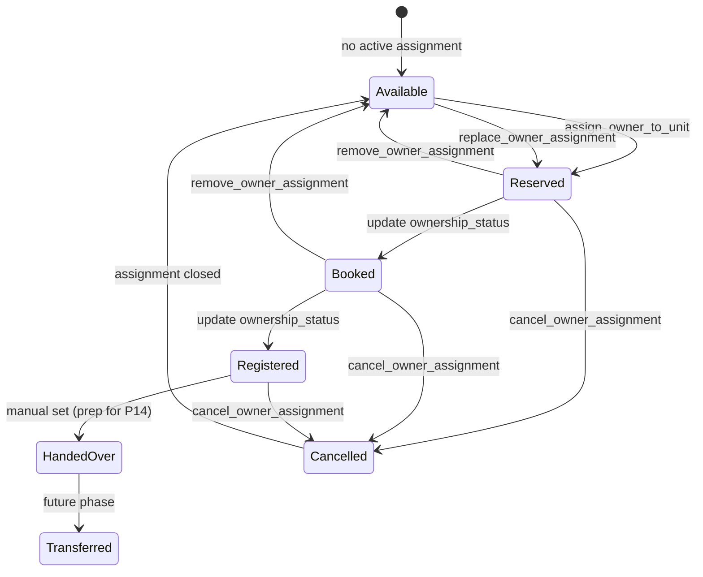

---

## Document Information

| Field | Value |
|---|---|
| **Document ID** | P11 |
| **Document Name** | Owner Assignment & Buyer Lifecycle Vertical Slice |
| **Phase** | P11 – Owner Assignment & Buyer Lifecycle |
| **Depends On** | P1–P5 (FINAL), P6A, P6B, P7, P8, P9, P9.1, P10 |
| **Status** | **Design — await approval before implementation** |
| **Created** | 2026-07-16 |
| **Branch** | `feature/owner-assignment` |
| **Source of Truth** | P1–P5, P3 BW-01, P10, BUILDER-004 (evolve — do not redesign P8/P9/P10) |

---

# P11 — Owner Assignment & Buyer Lifecycle Vertical Slice

## Objective

Implement **Owner Assignment** — the bridge between Builder Units and the future Owner. This phase covers **ownership preparation only**: buyer profile, unit assignment, ownership status, assignment history, and invitation readiness indicators.

A Unit with an active assignment is prepared for (but does not execute) Invitation, Document Upload, Digital Handover, or Flutter activation.

**Explicitly out of scope:** Invitations, Document Upload, Flutter activation, White Label, Handover execution.

---

## 1. Database Summary (Batch 7)

| File | Purpose |
|---|---|
| `supabase/migrations/20260716170000_p11_b07_owner_assignment.sql` | Batch 7 migration |
| `supabase/migrations/verify/20260716170000_p11_b07_owner_assignment_verify.sql` | Verification |

**Apply order:** P6A → P6B → P7 → P8 → P9 → P9.1 → P10 → **P11 Batch 7** → (stop)

### Table: `builder_owner_prospects`

Buyer identity — **not** an auth user. Persists across assignment changes within the builder org.

| Column | Type | Notes |
|---|---|---|
| `id` | uuid PK | |
| `organization_id` | uuid NOT NULL FK → `organizations` | Builder org scope |
| `buyer_name` | text NOT NULL | Full legal / display name |
| `first_name` | text | Optional structured name (compat with BUILDER-004) |
| `last_name` | text | Optional structured name |
| `mobile_number` | text NOT NULL | Primary mobile (E.164 normalized in app) |
| `alternate_mobile` | text | |
| `email` | text | |
| `government_id_type` | text | See §1.1 |
| `government_id_number` | text | Encrypted-at-rest policy deferred; stored as text in Batch 7 |
| `address_line` | text | |
| `city` | text | |
| `state` | text | |
| `country` | text DEFAULT `India` | |
| `pin_code` | text | |
| `emergency_contact_name` | text | |
| `emergency_contact_phone` | text | |
| `status` | text NOT NULL DEFAULT `active` | `active` \| `archived` |
| `prospect_user_id` | uuid NULL FK → `auth.users` | **NULL in P11** — populated in Flutter activation phase |
| `created_at` / `updated_at` | timestamptz | |
| `created_by` | uuid FK → `auth.users` | |
| `archived_at` | timestamptz | Soft delete |

**Indexes:** `(organization_id, buyer_name)`, `(organization_id, mobile_number)`, `(organization_id, email)` WHERE email IS NOT NULL

### Table: `builder_owner_assignments`

Unit ↔ buyer linkage with lifecycle status and history retention.

| Column | Type | Notes |
|---|---|---|
| `id` | uuid PK | |
| `organization_id` | uuid NOT NULL | Mirrored from unit via trigger |
| `project_id` | uuid NOT NULL FK → `builder_projects` | Denormalized for list performance |
| `unit_id` | uuid NOT NULL FK → `builder_units` | |
| `prospect_id` | uuid NOT NULL FK → `builder_owner_prospects` | |
| `ownership_status` | text NOT NULL | See §1.2 — buyer lifecycle on unit |
| `assignment_status` | text NOT NULL DEFAULT `active` | `active` \| `superseded` \| `removed` \| `cancelled` |
| `invitation_ready` | boolean NOT NULL DEFAULT false | Prep flag for P12 — **no invite sent in P11** |
| `assigned_at` | timestamptz NOT NULL DEFAULT now() | |
| `assigned_by` | uuid FK → `auth.users` | |
| `ended_at` | timestamptz | Set when assignment closes |
| `ended_by` | uuid FK → `auth.users` | |
| `end_reason` | text | `replaced` \| `removed` \| `cancelled` \| `transferred` |
| `notes` | text | |
| `created_at` / `updated_at` | timestamptz | |

**Partial unique index (BW-01):**

```sql
CREATE UNIQUE INDEX uq_builder_owner_assignments_active_unit
  ON builder_owner_assignments (unit_id)
  WHERE assignment_status = 'active';
```

**Indexes:** `(prospect_id)`, `(project_id, ownership_status)`, `(organization_id, assignment_status)`, `(unit_id, assigned_at DESC)`

### Table: `builder_owner_assignment_events`

Append-only assignment timeline (audit + UI history).

| Column | Type | Notes |
|---|---|---|
| `id` | uuid PK | |
| `assignment_id` | uuid NOT NULL FK → `builder_owner_assignments` | |
| `event_type` | text NOT NULL | See §7 |
| `event_label` | text NOT NULL | Human-readable title |
| `event_description` | text | |
| `metadata` | jsonb DEFAULT `{}` | Status transitions, actor, prior values |
| `created_at` | timestamptz NOT NULL DEFAULT now() | |
| `created_by` | uuid FK → `auth.users` | |

### 1.1 Government ID types (`government_id_type`)

| Value | Label |
|---|---|
| `aadhaar` | Aadhaar |
| `pan` | PAN |
| `passport` | Passport |
| `driving_license` | Driving License |
| `voter_id` | Voter ID |
| `other` | Other |

### 1.2 Ownership status (`ownership_status`)

Tracks buyer lifecycle on the unit — **distinct** from P10 `booking_status` (inventory axis).

| Value | Label | Meaning |
|---|---|---|
| `reserved` | Reserved | Buyer linked; hold / token stage |
| `booked` | Booked | Sale agreement / booking confirmed |
| `registered` | Registered | Legal registration complete |
| `handed_over` | Handed Over | Ownership transfer complete (set manually in P11; automated in Handover phase) |
| `cancelled` | Cancelled | Assignment cancelled before completion |
| `transferred` | Transferred | Ownership moved to another prospect (future workflow) |

**Unit-level “Available”:** No row with `assignment_status = 'active'`. Dashboard counts units without active assignment as **Available**.

### Triggers

| Trigger | Behavior |
|---|---|
| `enforce_owner_assignment_unit_scope` | Mirror `organization_id` + `project_id` from `builder_units`; reject cross-project unit |
| `enforce_owner_assignment_single_active` | Belt-and-suspenders with partial unique index |
| `sync_unit_booking_on_assignment` | On active assignment INSERT/UPDATE: set `builder_units.booking_status` → `reserved`/`sold` per ownership_status mapping; on close → `available` |
| `log_owner_assignment_event` | Auto-insert timeline row on status / assignment changes |

### RPCs

| RPC | Behavior |
|---|---|
| `list_builder_owner_prospects` | Search buyers by name/mobile/email; filter by project via join |
| `get_builder_owner_prospect` | Prospect profile + active assignment summary |
| `create_builder_owner_prospect` | Create buyer profile |
| `update_builder_owner_prospect` | Update buyer fields (not while archived) |
| `archive_builder_owner_prospect` | Soft archive prospect |
| `restore_builder_owner_prospect` | Restore archived prospect |
| `assign_owner_to_unit` | Create prospect (or link existing) + active assignment; close prior active if replace |
| `update_owner_assignment` | Update ownership_status, notes, buyer fields (via prospect) |
| `replace_owner_assignment` | Close current active; create new assignment (history preserved) |
| `remove_owner_assignment` | Close active assignment (`removed`); unit returns Available |
| `cancel_owner_assignment` | Close with `cancelled` ownership status |
| `get_owner_assignment_by_unit` | Active assignment + prospect for unit detail |
| `list_owner_assignment_history` | All assignments + events for a unit |
| `list_assigned_units` | Cross-project assigned-unit grid (dashboard / owners workspace) |
| `get_owner_assignment_dashboard_stats` | KPI counts by ownership status |

### Explicitly NOT in Batch 7

- `owner_invitations` table or invite tokens
- Document / handover tables
- Flutter `properties` / `auth.users` creation
- White-label configuration

---

## 2. Angular Folder Structure

Evolve existing `src/features/builder-portal/owners/` — **do not create a parallel module**.

```
src/features/builder-portal/owners/
├── owners.routes.ts
├── index.ts
├── p11-smoke.spec.ts
├── models/
│   ├── owner-prospect.model.ts       (evolve owner.model.ts — BuyerProspect)
│   ├── owner-assignment.model.ts     (split from owner.model.ts)
│   └── owner-assignment-event.model.ts
├── config/
│   ├── owners.config.ts              (options, columns, gov-id types)
│   └── owners.seed.ts                (replaces MOCK_* in config)
├── utils/
│   ├── ownership-status.utils.ts     (labels, transitions, invitation-ready rules)
│   └── assignment-validation.utils.ts
├── repositories/
│   ├── builder-owner-prospect.repository.ts
│   ├── builder-owner-assignment.repository.ts
│   ├── in-memory-builder-owner-prospect.repository.ts
│   ├── in-memory-builder-owner-assignment.repository.ts
│   └── builder-owner-assignment.api.spec.ts
├── providers/owner-assignment.providers.ts
├── services/
│   ├── owner-prospect.service.ts     (replaces owner CRUD portion of OwnerStoreService)
│   ├── owner-assignment.service.ts   (assign / replace / remove / history)
│   ├── owner-list-state.service.ts   (evolve — ownership filters)
│   ├── owner-form-state.service.ts   (evolve — full buyer profile)
│   └── owner-assignment-form-state.service.ts (evolve)
├── resolvers/
│   ├── owner-prospect.resolver.ts
│   └── unit-assignment.resolver.ts
├── guards/owner-unsaved-changes.guard.ts
├── pages/
│   ├── owner-workspace-page.*        (evolve — ownership KPIs)
│   ├── owner-assign-page.*           (evolve — full buyer form)
│   ├── owner-detail-page.*           (evolve — remove invite actions)
│   ├── owner-edit-page.*
│   └── unit-assignment-page.*        (NEW — unit-scoped assignment hub)
├── components/
│   ├── shared/    (evolve badges — ownership status)
│   ├── list/      (evolve filters: ownership status, project)
│   ├── workspace/ (ownership-status KPIs, assigned-units widget)
│   ├── detail/
│   │   ├── buyer-overview.component.ts
│   │   ├── assignment-timeline.component.ts      (evolve customer-timeline)
│   │   ├── assignment-history-panel.component.ts   (NEW)
│   │   ├── invitation-ready-panel.component.ts     (read-only prep — replaces InvitationCenter actions)
│   │   ├── owner-document-placeholder.component.ts (unchanged placeholder)
│   │   └── owner-handover-placeholder.component.ts (unchanged placeholder)
│   └── form/
│       ├── buyer-profile-form.component.ts         (evolve owner-profile-form)
│       └── owner-assignment-wizard.component.ts    (evolve — no invitation send step)
└── styles/_owners.scss
```

**Cross-module additions (additive only):**

```
src/features/builder-portal/projects/units/
├── pages/unit-detail-page.*          (+ Assign Owner CTA, assignment summary)
├── components/detail/
│   └── unit-assignment-summary.component.ts   (NEW — compact buyer card on unit detail)
└── units.routes.ts                   (+ optional nested assignment route)
```

**Provider registration:** `provideBuilderOwnerAssignment()` in `app.config.ts`.

**Deprecate:** `OwnerStoreService` — migrate to `OwnerProspectService` + `OwnerAssignmentService`.

---

## 3. Routes

### 3.1 Owners workspace (existing — evolved)

| Path | Component | Notes |
|---|---|---|
| `/builder-portal/owners` | `OwnerWorkspacePageComponent` | Dashboard + buyer/assignment list |
| `/builder-portal/owners/assign` | `OwnerAssignPageComponent` | Global assign wizard (`?unitId=` deep-link) |
| `/builder-portal/owners/:prospectId` | `OwnerDetailPageComponent` | Buyer profile + active assignment |
| `/builder-portal/owners/:prospectId/edit` | `OwnerEditPageComponent` | Edit buyer profile |

### 3.2 Unit-scoped assignment (NEW)

| Path | Component | Notes |
|---|---|---|
| `/builder-portal/projects/:id/units/:unitId/assignment` | `UnitAssignmentPageComponent` | Direct-units hierarchy |
| `/builder-portal/projects/:id/buildings/:buildingId/units/:unitId/assignment` | `UnitAssignmentPageComponent` | Building-based hierarchy |

**Unit detail** remains at existing unit routes; assignment hub linked via CTA.

**Query-param deep links:**

- `/builder-portal/owners/assign?unitId={id}&projectId={id}` — pre-select unit in wizard
- `/builder-portal/owners?ownershipStatus=booked&projectId={id}` — filtered workspace

**Permission:** Existing `id-08-owner-assignment-prospect` (`:read` view, `:contribute` assign/edit).

---

## 4. Components

| Component | Responsibility |
|---|---|
| `BuyerProfileFormComponent` | Full buyer fields (§Buyer Information) |
| `OwnerAssignmentWizardComponent` | Steps: Buyer → Unit confirm → Ownership status → Review |
| `UnitAssignmentSummaryComponent` | Compact card on unit detail — buyer name, status, link to hub |
| `UnitAssignmentPageComponent` | Unit hub: assign / edit / view / timeline / history |
| `AssignmentTimelineComponent` | Event feed from `builder_owner_assignment_events` |
| `AssignmentHistoryPanelComponent` | Prior assignments table for same unit |
| `InvitationReadyPanelComponent` | Read-only readiness checklist (no send/resend) |
| `OwnershipStatusBadgeComponent` | Status chip (reserved → handed_over) |
| `AssignedUnitsWidgetComponent` | Workspace widget — recent assigned units |
| `OwnershipDashboardKpisComponent` | Available / Reserved / Booked / Registered / Handed Over counts |

**Removed / stubbed in P11:**

- `InvitationCenterComponent` invite actions (resend, cancel, reminder) → replaced by `InvitationReadyPanelComponent` (read-only)
- Invitation-status donut chart → replaced by ownership-status breakdown chart

---

## 5. Services

| Service | Role |
|---|---|
| `OwnerProspectService` | Buyer CRUD, search, archive/restore |
| `OwnerAssignmentService` | Assign, replace, remove, cancel, history, dashboard stats |
| `OwnerListStateService` | Search buyer, filter by ownership status / project / unit |
| `OwnerFormStateService` | Buyer profile validation |
| `OwnerAssignmentFormStateService` | Assignment wizard validation |
| `UnitService` (P10) | Read unit; check availability for assignment |
| `ProjectStoreService` (P8) | Project context for filters |

---

## 6. Repository

```typescript
abstract class BuilderOwnerProspectRepository {
  abstract list(query: OwnerProspectListQuery): OwnerProspectListResult;
  abstract getById(id: string): OwnerProspect | undefined;
  abstract create(orgId: string, model: BuyerProfileFormModel): OwnerProspect;
  abstract update(id: string, model: BuyerProfileFormModel): OwnerProspect | undefined;
  abstract archive(id: string): OwnerProspect | undefined;
  abstract restore(id: string): OwnerProspect | undefined;
  abstract findByMobile(orgId: string, mobile: string): OwnerProspect | undefined;
}

abstract class BuilderOwnerAssignmentRepository {
  abstract getActiveByUnitId(unitId: string): OwnerAssignment | undefined;
  abstract getHistoryByUnitId(unitId: string): readonly OwnerAssignment[];
  abstract listAssignedUnits(query: AssignedUnitsListQuery): AssignedUnitsListResult;
  abstract assign(params: AssignOwnerParams): OwnerAssignment;
  abstract update(id: string, patch: OwnerAssignmentUpdatePatch): OwnerAssignment | undefined;
  abstract replace(params: ReplaceOwnerParams): OwnerAssignment;
  abstract remove(id: string, reason?: string): OwnerAssignment | undefined;
  abstract cancel(id: string): OwnerAssignment | undefined;
  abstract getEvents(assignmentId: string): readonly OwnerAssignmentEvent[];
  abstract dashboardStats(orgId: string, projectId?: string): OwnershipDashboardStats;
  abstract hasActiveAssignment(unitId: string): boolean;
}
```

`InMemory*` implementations mirror Batch 7 RPC semantics; seeds reference P10 unit IDs.

---

## 7. API Contracts

### 7.1 `assign_owner_to_unit`

**Request:**

```json
{
  "unit_id": "uuid",
  "prospect_id": "uuid-or-null",
  "prospect": {
    "buyer_name": "Priya Sharma",
    "mobile_number": "+919820011122",
    "email": "priya@example.com",
    "government_id_type": "aadhaar",
    "government_id_number": "XXXX-XXXX-1234",
    "address_line": "12 MG Road",
    "city": "Gurugram",
    "state": "Haryana",
    "country": "India",
    "pin_code": "122001",
    "emergency_contact_name": "Raj Sharma",
    "emergency_contact_phone": "+919820099988",
    "alternate_mobile": "+919820033344"
  },
  "ownership_status": "reserved",
  "notes": "Token amount received",
  "replace_existing": false
}
```

**Response:** `{ assignment, prospect, events[] }`

**Errors:** `unit_not_found`, `unit_already_assigned`, `prospect_archived`, `invalid_ownership_status`, `not_authorized`

### 7.2 `replace_owner_assignment`

Closes active assignment (`assignment_status = superseded`, `end_reason = replaced`), creates new active row, logs events. **One active owner per unit** enforced.

### 7.3 `remove_owner_assignment`

Closes active (`assignment_status = removed`); unit ownership returns **Available**.

### 7.4 `list_assigned_units`

| Param | Notes |
|---|---|
| `organization_id` | Required |
| `project_id` | Optional filter |
| `ownership_status` | Optional filter |
| `search` | Buyer name, mobile, unit number, code |
| `page` / `page_size` | Pagination |

### 7.5 `get_owner_assignment_dashboard_stats`

```json
{
  "available_units": 42,
  "reserved_units": 8,
  "booked_units": 15,
  "registered_units": 6,
  "handed_over_units": 3,
  "cancelled_units": 2,
  "transferred_units": 0
}
```

Counts are **unit-based** (active assignment ownership_status or no assignment = available).

---

## 8. Validation Rules

| Rule | Enforcement |
|---|---|
| **BW-01: One active owner per unit** | Partial unique index + service check before assign |
| **No duplicate active assignment** | `hasActiveAssignment(unitId)` rejects assign unless `replace_existing = true` |
| **Assignment history preserved** | Close row (set `ended_at`, `assignment_status`); never hard-delete assignments |
| **Soft delete only** | Prospects archived via `status = archived`; assignments closed, not deleted |
| **Buyer mobile required** | Form + RPC validation |
| **Email format** | Optional but validated when provided |
| **Government ID** | Type required when number provided; number required when type selected |
| **PIN code** | Format validation per country (India: 6 digits) |
| **Unit must be active** | Cannot assign to archived unit (`builder_units.status = archived`) |
| **Org scope** | Prospect + assignment must belong to caller's builder org |
| **Replace vs Remove** | Replace creates new prospect link; Remove returns unit to Available |
| **Invitation ready** | Auto-computed: `ownership_status IN (booked, registered)` AND required buyer fields complete — **does not send invite** |
| **Handed over in P11** | Manual status transition only; no handover RPC |

---

## 9. Assignment Lifecycle

### 9.1 State machine (ownership status — active assignment)



### 9.2 Assignment record lifecycle (`assignment_status`)

| Status | Meaning |
|---|---|
| `active` | Current owner link for unit |
| `superseded` | Replaced by newer assignment (history) |
| `removed` | Builder removed assignment |
| `cancelled` | Deal cancelled |

### 9.3 Event types (`builder_owner_assignment_events`)

| `event_type` | When |
|---|---|
| `assigned` | New active assignment created |
| `status_changed` | `ownership_status` updated |
| `buyer_updated` | Prospect profile edited |
| `replaced` | Prior owner replaced |
| `removed` | Assignment removed |
| `cancelled` | Assignment cancelled |
| `invitation_ready` | Readiness flag set true (P11 — no invite sent) |

### 9.4 P10 `booking_status` sync (trigger)

| `ownership_status` | `builder_units.booking_status` |
|---|---|
| `reserved` | `reserved` |
| `booked`, `registered` | `sold` |
| `handed_over`, `transferred` | `sold` |
| Assignment closed | `available` |

---

## 10. UI Flows

### 10.1 Unit → Owner Assignment

```
Unit Detail
  → UnitAssignmentSummary (buyer card or "Assign buyer" CTA)
  → Unit Assignment Page
      ├── Assign Buyer (wizard) — if Available
      ├── Edit Buyer — profile form
      ├── View Buyer — read-only overview
      ├── Update Status — ownership status dropdown
      ├── Assignment Timeline — events
      └── Assignment History — prior assignments
```

### 10.2 Global Owners workspace

```
Owners Workspace
  → KPIs: Available / Reserved / Booked / Registered / Handed Over units
  → Search buyers + filter by ownership status / project
  → Assign wizard (global entry)
  → Buyer detail (profile + active assignment + history)
```

### 10.3 Replace / Remove (dialogs — not routes)

- **Replace owner:** Modal on unit assignment page or buyer detail — closes current, opens assign wizard with unit pre-selected
- **Remove owner:** Confirm dialog → `remove_owner_assignment`

---

## 11. Migration from BUILDER-004 Mock Module

| Current (mock) | P11 target |
|---|---|
| `Owner` (first/last name) | `OwnerProspect` / `buyer_name` + extended fields |
| `OwnerAssignment` + embedded `Invitation` | `OwnerAssignment` — no invitation entity in P11 |
| `AssignmentStatus: active/reassigned/removed` | `assignment_status: active/superseded/removed/cancelled` |
| `activationStatus` on owner | Removed — replaced by `ownership_status` on assignment |
| `InvitationCenter` actions | `InvitationReadyPanel` (read-only) |
| `OwnerStoreService` | `OwnerProspectService` + `OwnerAssignmentService` + repositories |
| Invitation KPIs | Ownership-status KPIs |
| No unit-scoped page | `UnitAssignmentPageComponent` |
| No SQL | Batch 7 migration |
| No tests | Full test suite (§12) |

**Seed migration:** Remap `MOCK_OWNERS` → `owners.seed.ts` as prospects; `MOCK_ASSIGNMENTS` → assignments with `ownership_status`; strip invitation send state.

---

## 12. Testing

| File | Type |
|---|---|
| `services/owner-prospect.service.spec.ts` | Unit — CRUD, validation |
| `services/owner-assignment.service.spec.ts` | Unit — assign, replace, remove, BW-01 |
| `utils/ownership-status.utils.spec.ts` | Unit — transitions, invitation-ready rules |
| `utils/assignment-validation.utils.spec.ts` | Unit — field validation |
| `repositories/in-memory-builder-owner-assignment.repository.spec.ts` | Repository — active uniqueness |
| `repositories/builder-owner-assignment.api.spec.ts` | API contract documentation |
| `p11-smoke.spec.ts` | Smoke checklist |
| Integration | Assign from unit detail → appears on owners workspace → replace → history |

**Assignment validation tests (required):**

- Second assign to same unit without replace → rejected
- Replace closes prior assignment; exactly one active
- Remove returns unit to Available
- Cancel sets `ownership_status = cancelled`
- History lists all prior assignments for unit
- Dashboard counts match assignment data

---

## 13. Verification Checklist

- [ ] Migration applies cleanly after P10
- [ ] Verify SQL passes (`*_verify.sql`)
- [ ] Assign buyer to available unit succeeds
- [ ] Duplicate active assignment rejected (BW-01)
- [ ] Replace owner preserves history
- [ ] Remove owner returns unit to Available
- [ ] Ownership status transitions work
- [ ] `invitation_ready` flag sets when criteria met — **no invite sent**
- [ ] Unit detail shows buyer summary + link
- [ ] Unit assignment page: timeline + history
- [ ] Owners workspace KPIs: Available / Reserved / Booked / Registered / Handed Over
- [ ] Search buyer by name / mobile / unit
- [ ] Filter by ownership status and project
- [ ] Buyer profile: all §Buyer Information fields
- [ ] Soft archive prospect only (no hard delete)
- [ ] No invitation send / resend / cancel UI active
- [ ] No document upload or Flutter activation code
- [ ] `npm run build` + `npm run lint` + `npm test` pass

---

## 14. Known Limitations

| Limitation | Notes |
|---|---|
| **No Supabase wire-up in Angular** | In-memory repository default until API client phase |
| **No invitation delivery** | `invitation_ready` is a flag only — P12 implements invites |
| **Handed Over status** | Manual assignment status in P11; automated only in Handover phase |
| **Transferred workflow** | Status exists; full transfer UX deferred |
| **No auth user creation** | `prospect_user_id` always NULL in P11 |
| **Government ID storage** | Plain text in Batch 7; field-level encryption deferred |
| **No document completeness gate** | Invitation-ready based on buyer fields + ownership status only |
| **BUILDER-004 invitation mock** | Removed — breaks backward compat with mock invitation KPIs (intentional) |
| **Cross-org buyer dedup** | Same mobile may exist in different builder orgs (by design) |

---

## 15. Implementation Sequence (post-approval)

1. **SQL** — Batch 7 migration + verify
2. **Models** — prospect, assignment, event; evolve configs/seeds
3. **Repositories + services** — replace `OwnerStoreService`
4. **Unit-scoped UI** — assignment page + unit detail summary
5. **Evolve owners workspace** — ownership KPIs, filters
6. **Buyer form** — full field set
7. **Remove invitation actions** — readiness panel only
8. **Tests** — unit, repository, validation, smoke
9. **Docs** — update `BUILDER-004_Owner_Assignment.md` status

---

**STOP — Await approval before implementation.**
