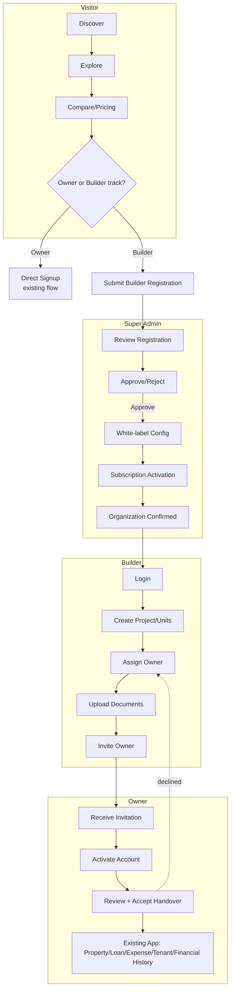
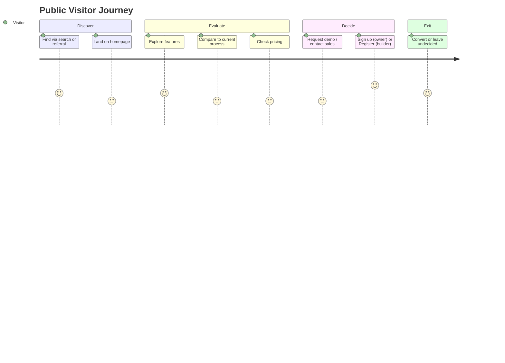
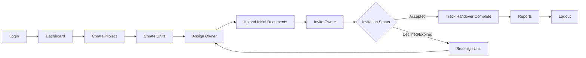
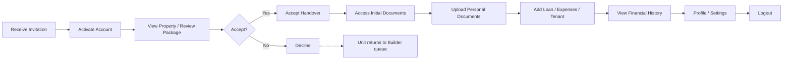
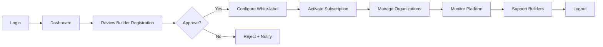
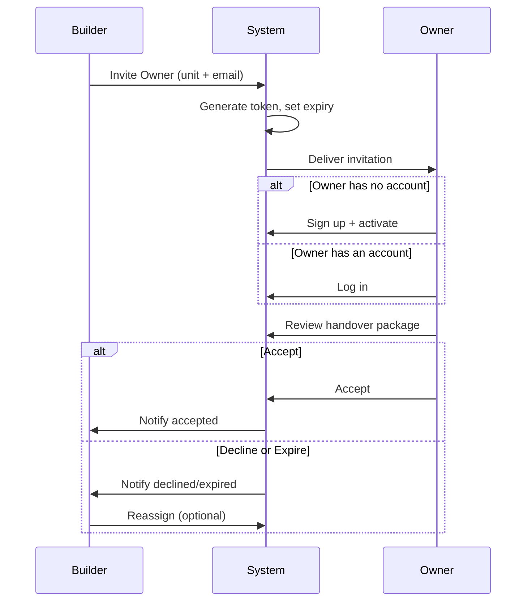
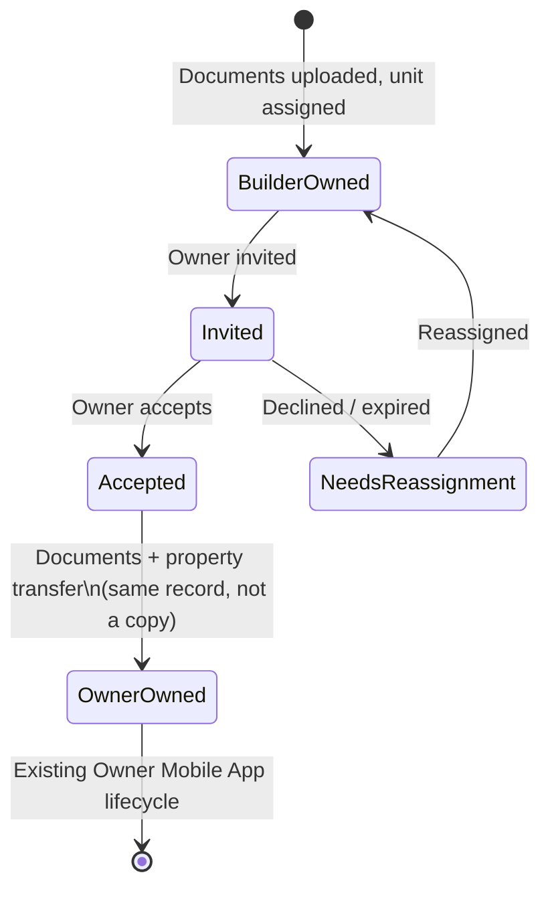
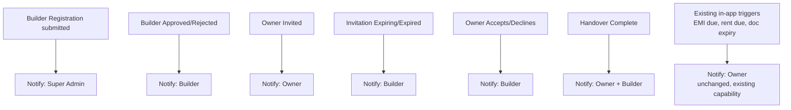
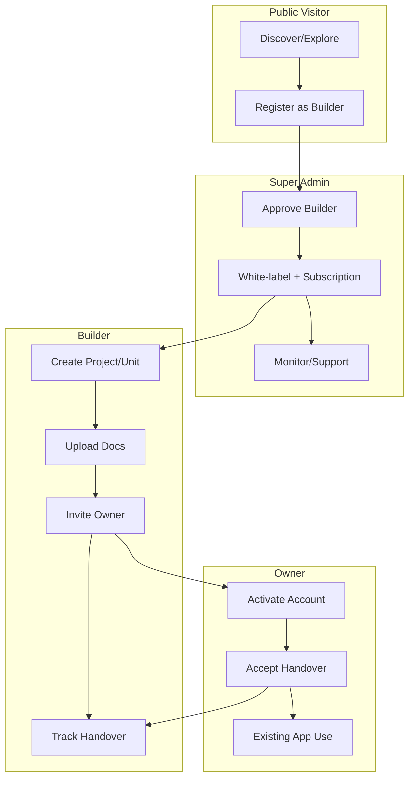

# A-003 — User Journey Diagrams

**Companion to:** [`../A-003_User_Journey.md`](../A-003_User_Journey.md)
**Purpose:** All diagrams referenced by A-003, kept separate from the journey analysis per this document's own deliverable structure.

---

## 1. User Journey Map (all actors, high level)

---

## 2. Customer Journey Map (Public Visitor, emotional/experience layer)

---

## 3. Builder Journey

---

## 4. Owner Journey

---

## 5. Super Admin Journey

---

## 6. Invitation Journey (Owner Invitation, detail)

---

## 7. Handover Journey (Property + Document transfer, detail)

---

## 8. Notification Journey (cross-actor)

---

## 9. Journey Swimlane Diagram (full cross-actor flow)

