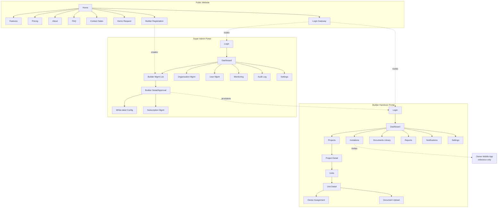
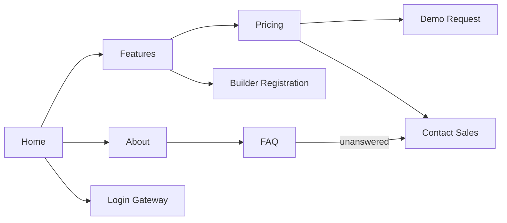
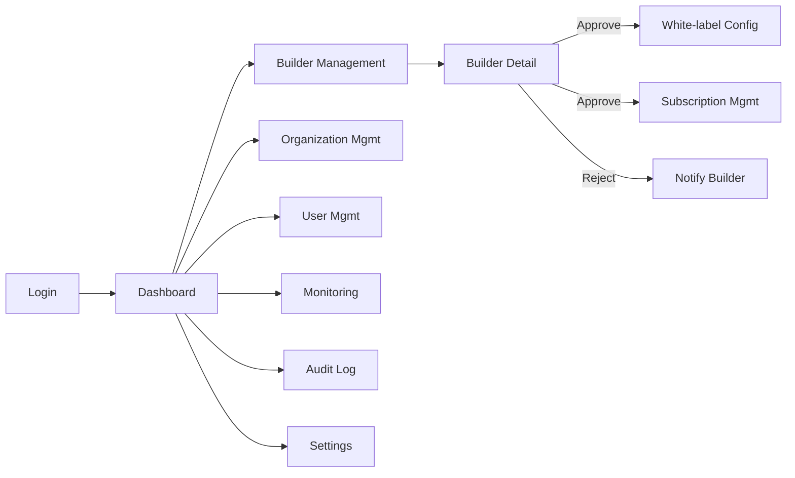
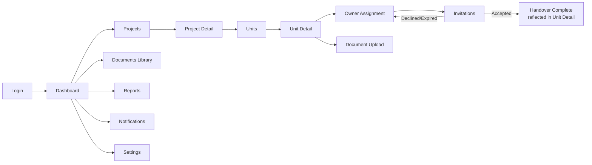
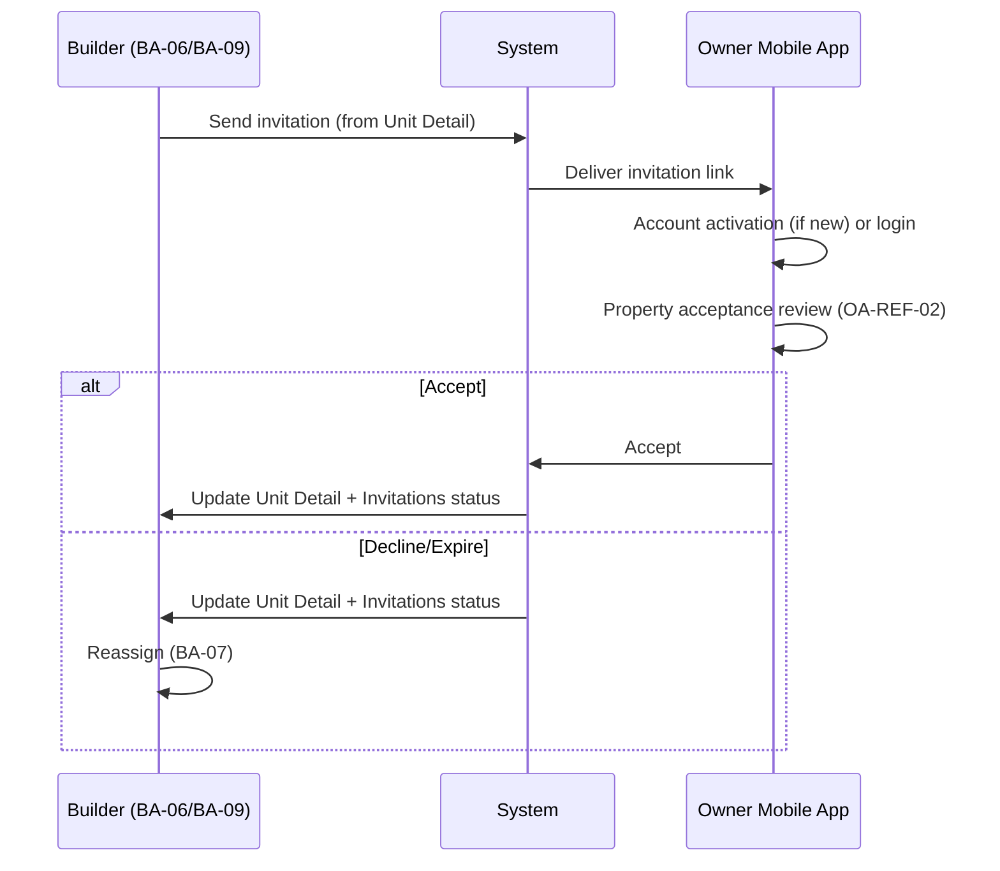
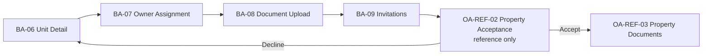
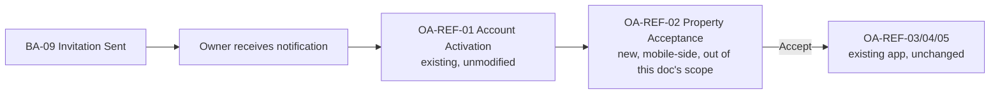
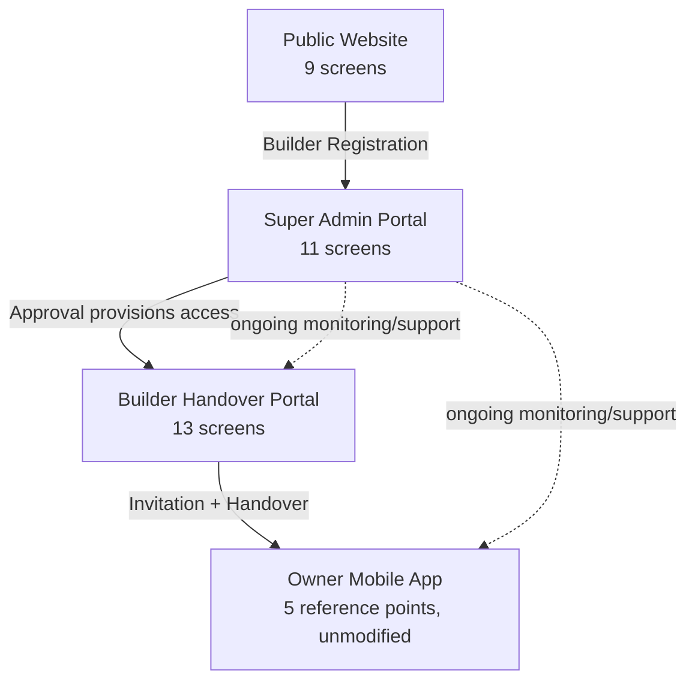
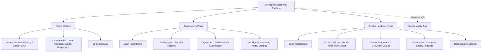

# A-004 — Screen Flow Diagrams

**Companion to:** [`../A-004_Screen_Flow.md`](../A-004_Screen_Flow.md)

---

## 1. Platform Screen Map

---

## 2. Public Website Screen Flow

---

## 3. Super Admin Screen Flow

---

## 4. Builder Portal Screen Flow

---

## 5. Invitation Flow (screen-level)

---

## 6. Property Handover Flow (screen-level)

---

## 7. Owner Activation Flow (screen-level, reference only)

---

## 8. High-Level Screen Relationships

---

## 9. Screen Hierarchy (tree)

