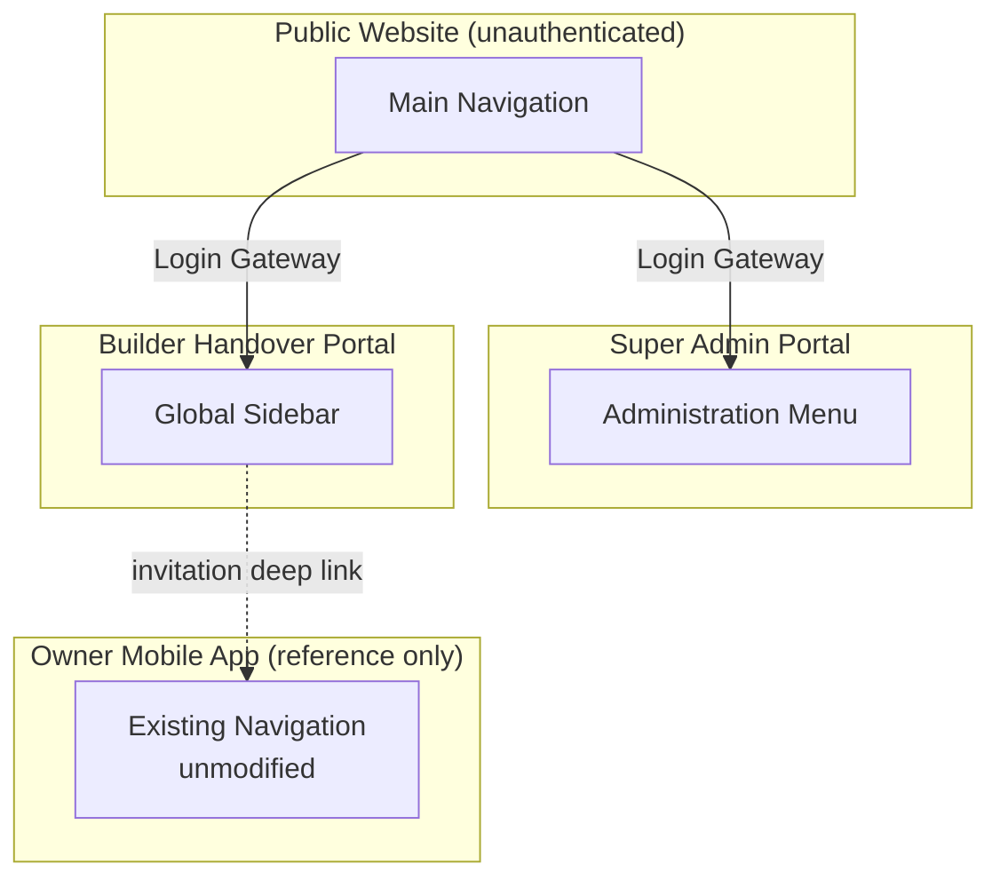
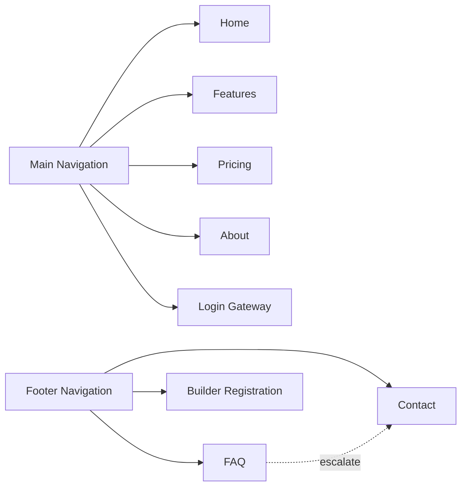
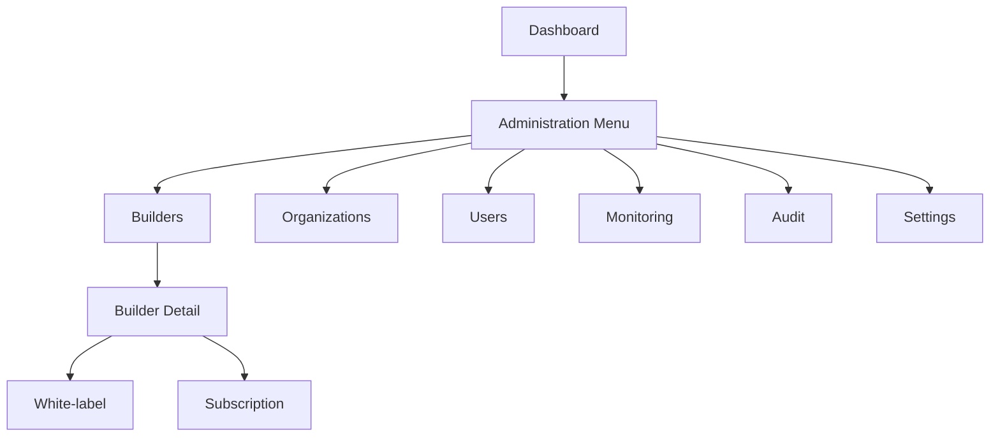
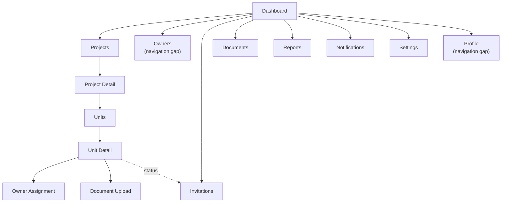
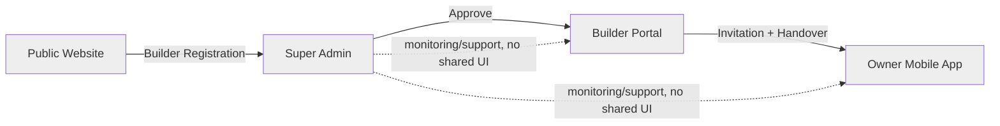
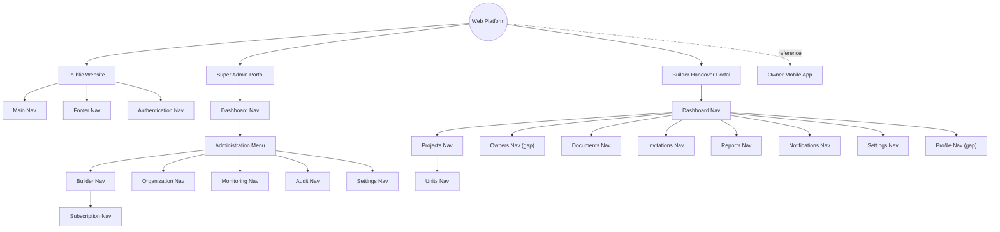
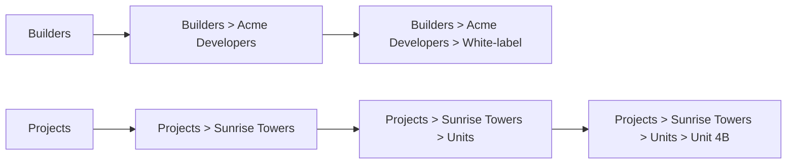
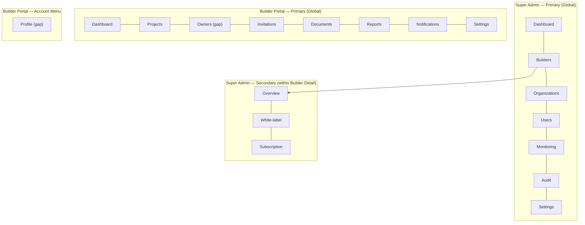
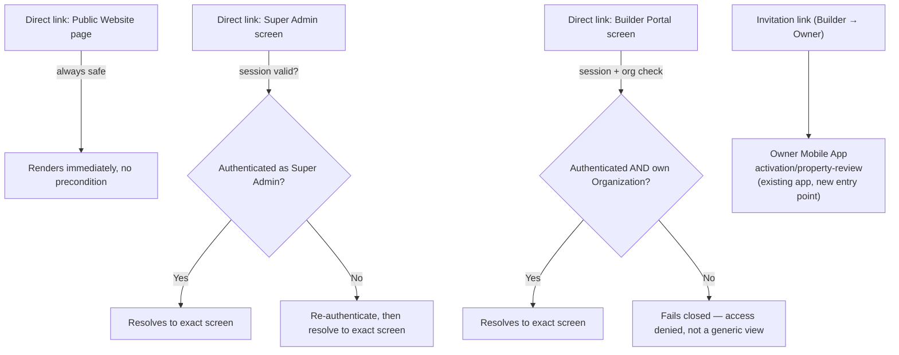

# A-005 — Navigation Diagrams

**Companion to:** [`../A-005_Navigation_Flow.md`](../A-005_Navigation_Flow.md)

---

## 1. Global Navigation Map

---

## 2. Public Website Navigation

---

## 3. Super Admin Navigation

---

## 4. Builder Navigation

---

## 5. Cross Product Navigation

No product ever shares a navigation surface with another — every arrow above is a one-time handoff (registration, approval, invitation), never a merged menu.

---

## 6. Navigation Hierarchy

---

## 7. Breadcrumb Flow

Breadcrumbs appear only at three-or-more levels of depth (A-005 §11) — Public Website and shallow Super Admin/Builder sections (Monitoring, Audit, Settings, Reports, Notifications) rely on the persistent Global Navigation menu alone.

---

## 8. Menu Hierarchy

---

## 9. Deep Link Map

