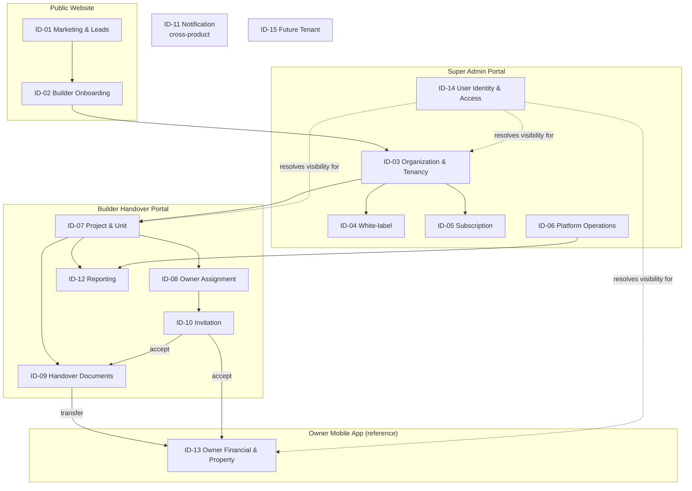
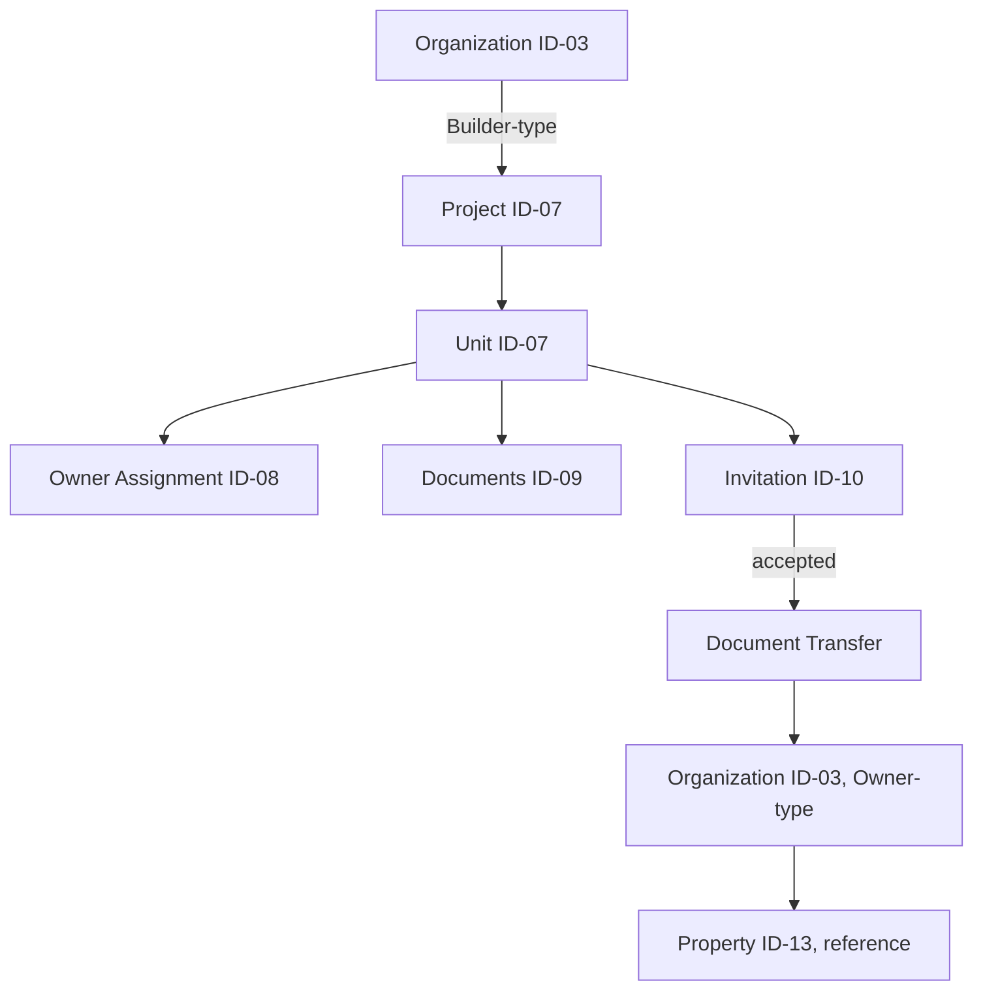
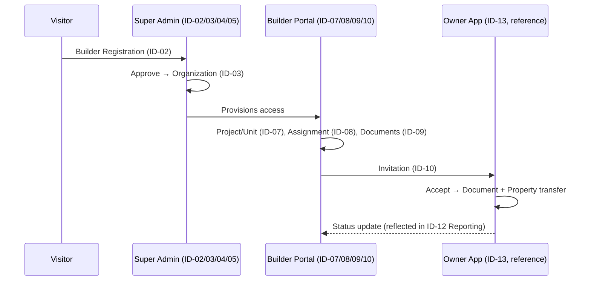
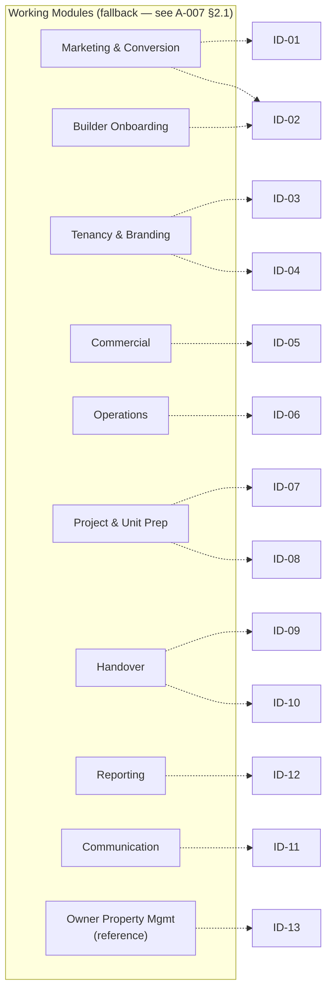
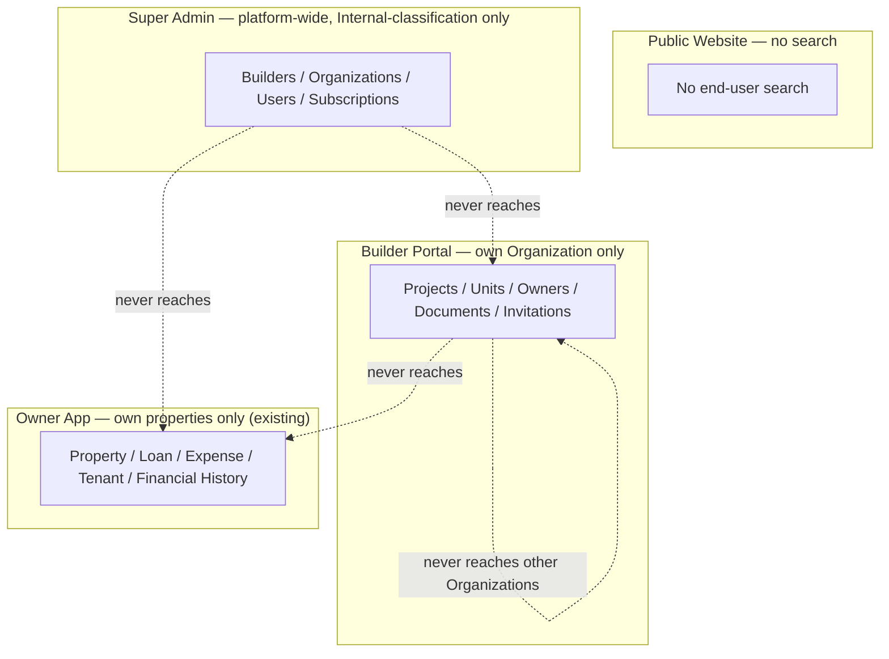
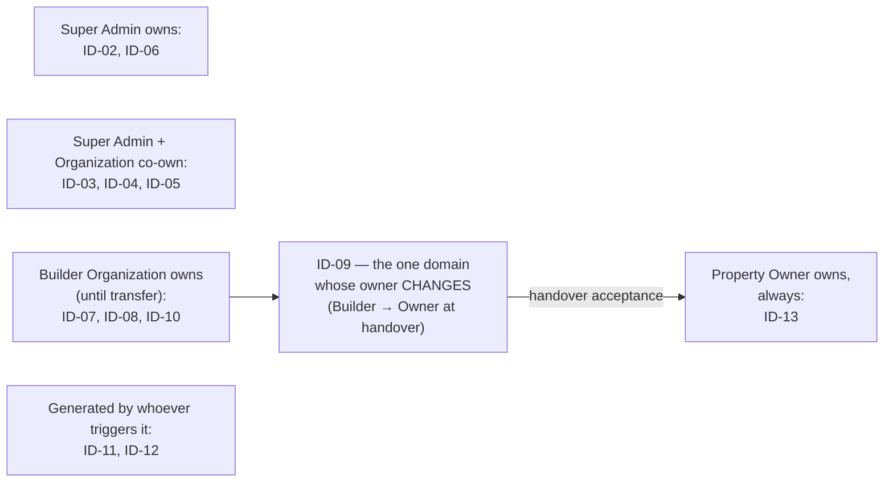
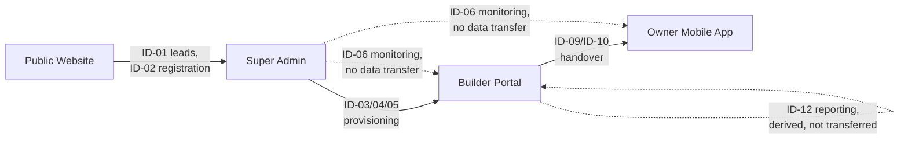

# A-007 — Information Architecture Diagrams

**Companion to:** [`../A-007_Information_Architecture.md`](../A-007_Information_Architecture.md)

---

## 1. Information Domain Map

---

## 2. Content Hierarchy Diagram

---

## 3. Information Flow Diagram

---

## 4. Module Information Relationships

Dashed lines indicate the relationship is provisional — traced through the fallback module reference, not a verified A-006.

---

## 5. Search Architecture Diagram

---

## 6. Information Ownership Diagram

---

## 7. Cross Product Information Flow

