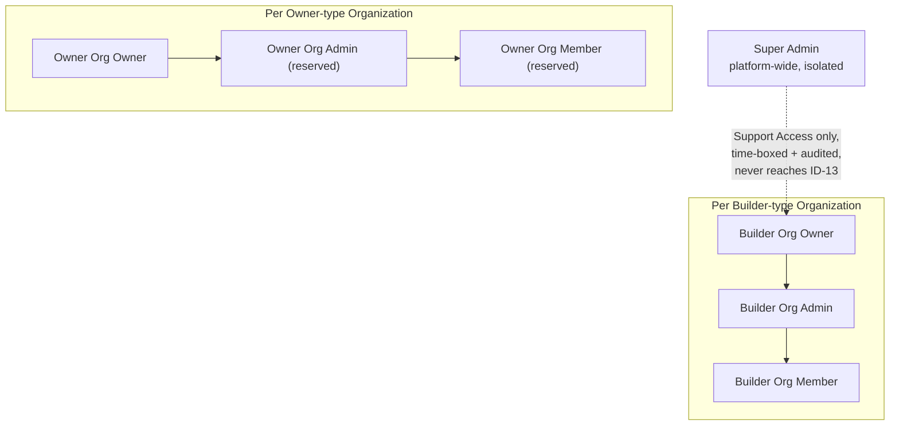
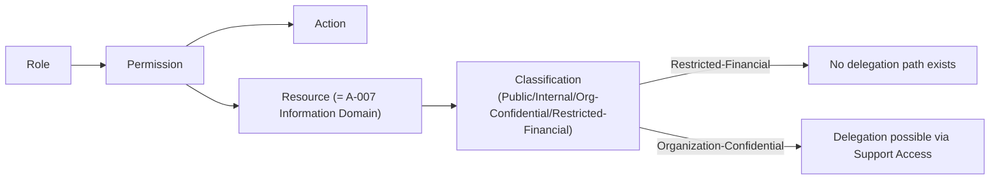
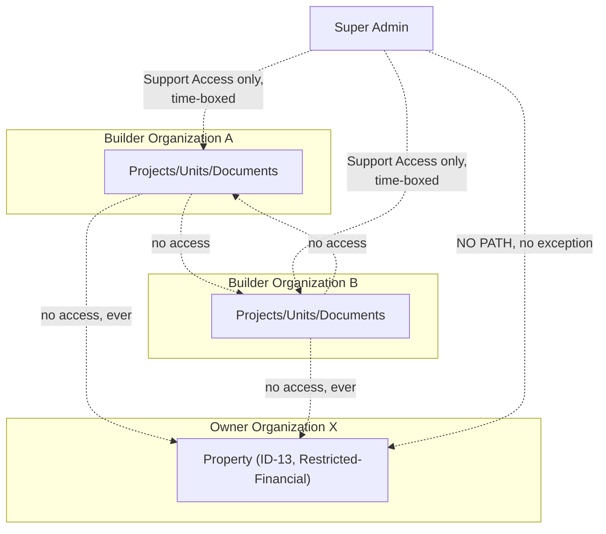
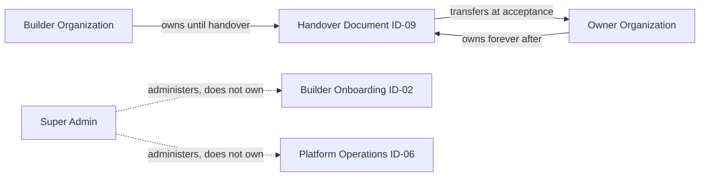
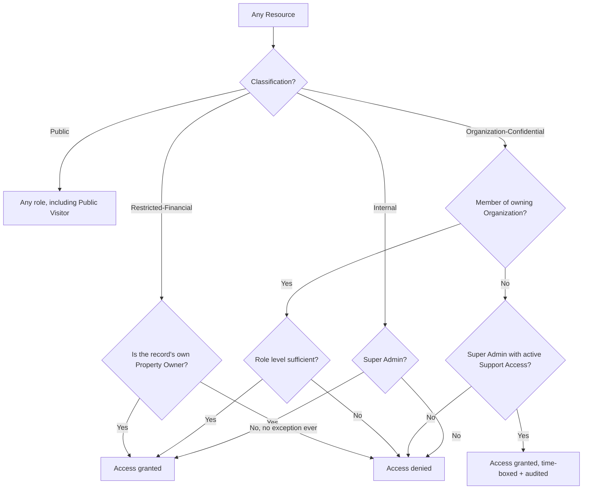

# A-008 — RBAC Diagrams

**Companion to:** [`../A-008_RBAC.md`](../A-008_RBAC.md)

---

## 1. RBAC Hierarchy

---

## 2. Permission Relationships

---

## 3. Organization Isolation Diagram

---

## 4. Ownership Diagram

---

## 5. Resource Access Diagram

