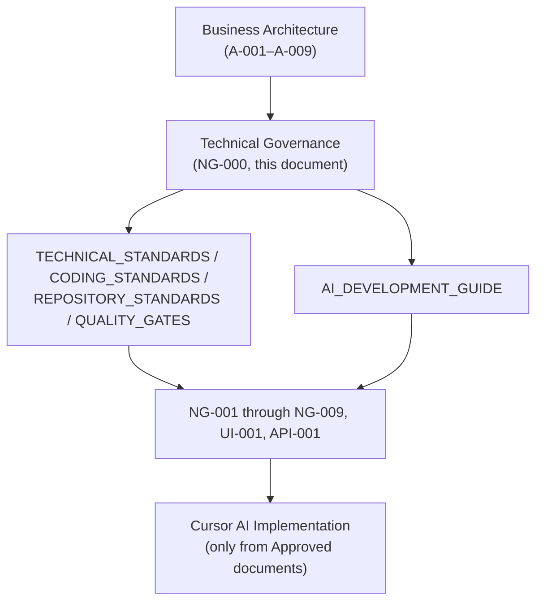
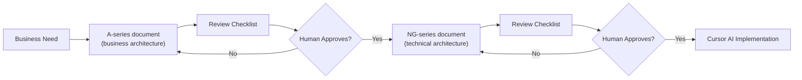
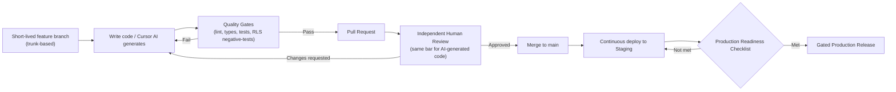
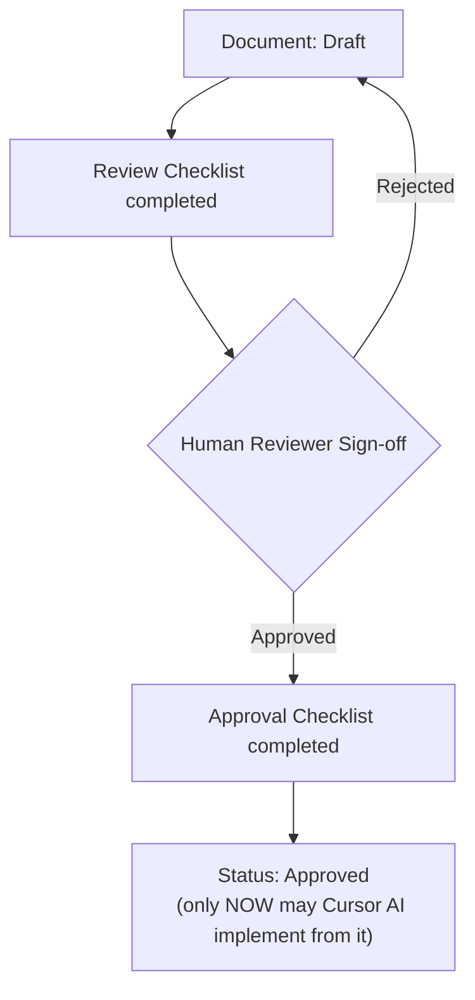
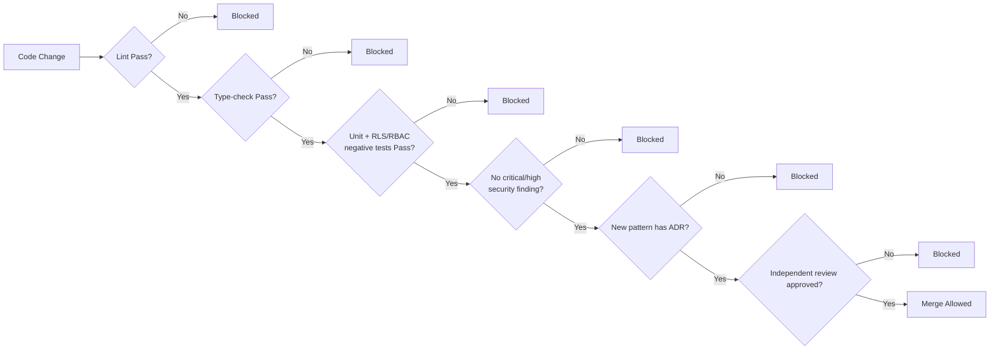
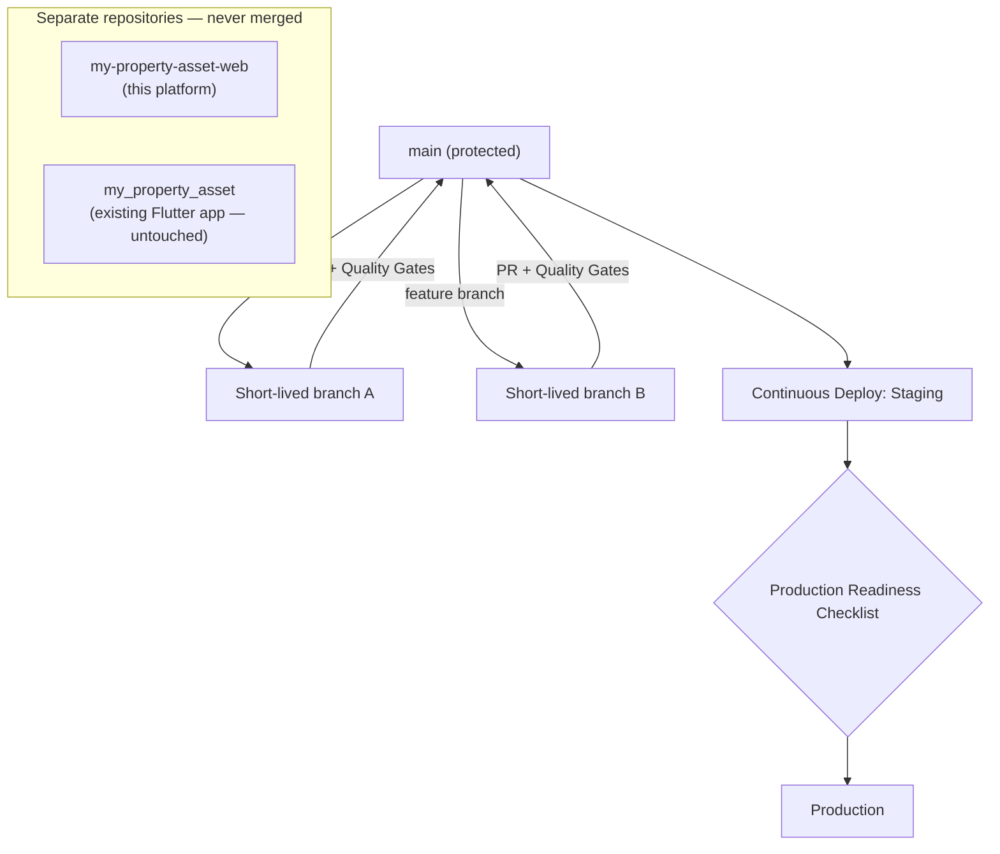
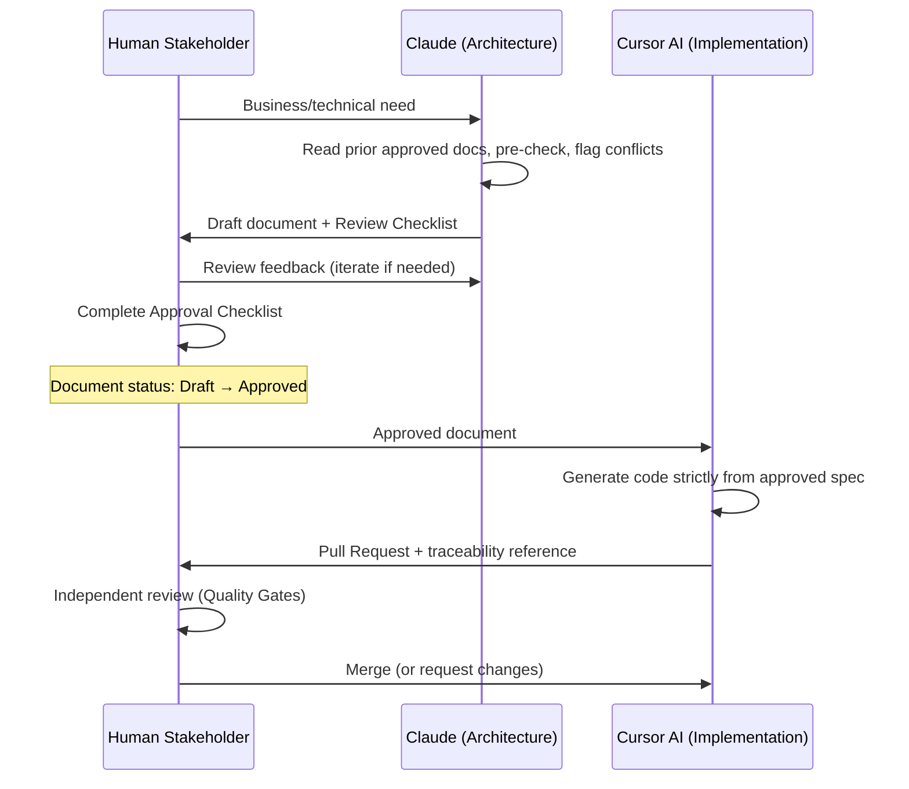

# NG-000 — Technical Governance Diagrams

**Companion to:** [`../NG-000_Web_Platform_Technical_Governance.md`](../NG-000_Web_Platform_Technical_Governance.md)

---

## 1. Technical Governance Model

---

## 2. Architecture Governance Flow

---

## 3. Development Workflow

---

## 4. Approval Workflow

---

## 5. Quality Gate Flow

---

## 6. Repository Governance

---

## 7. AI Collaboration Workflow

