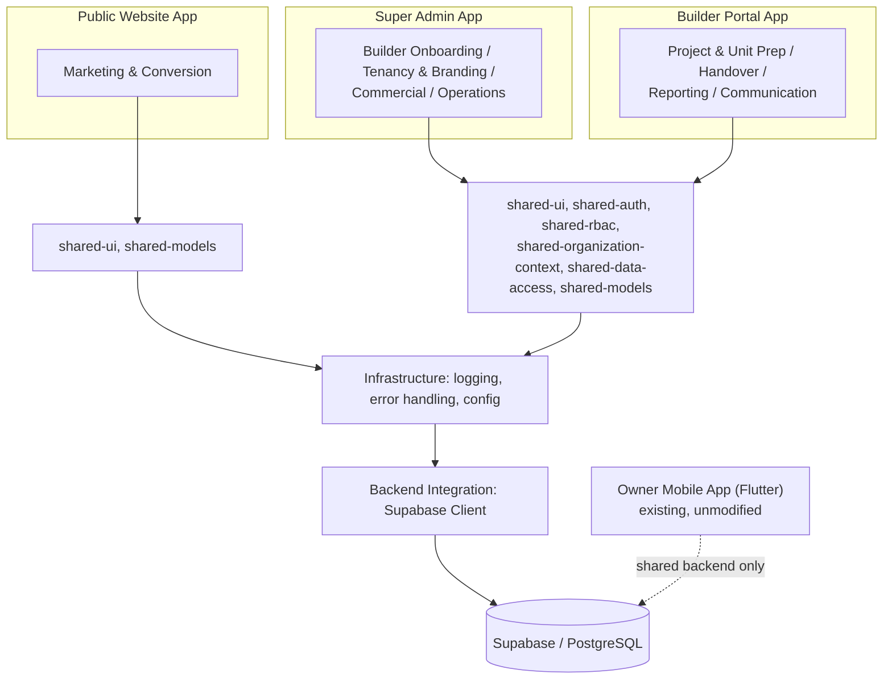
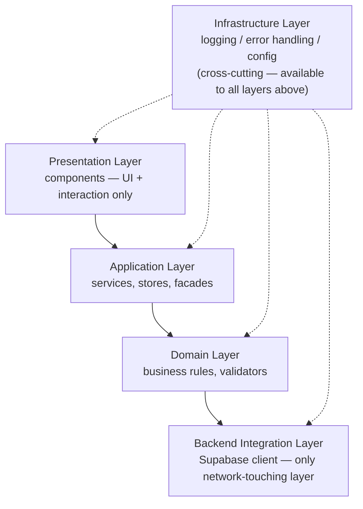
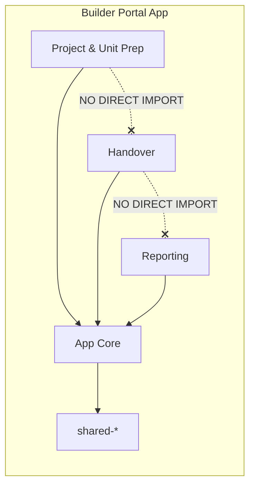
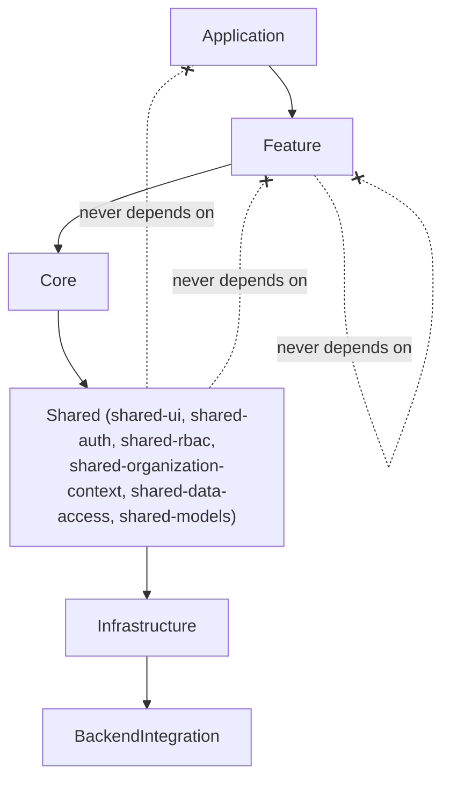
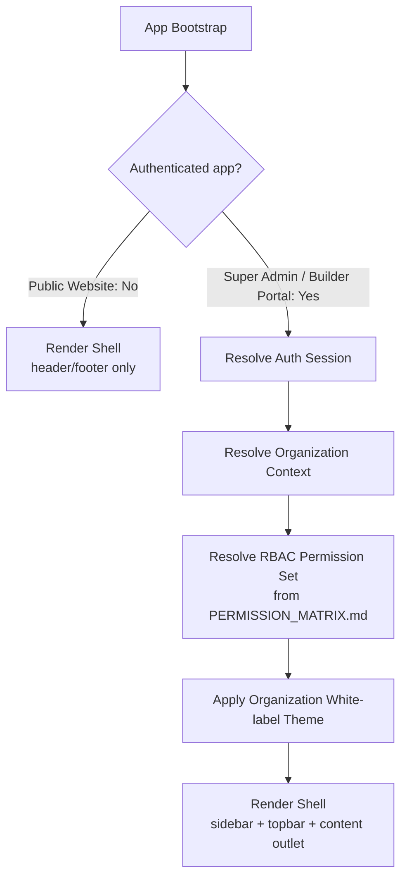
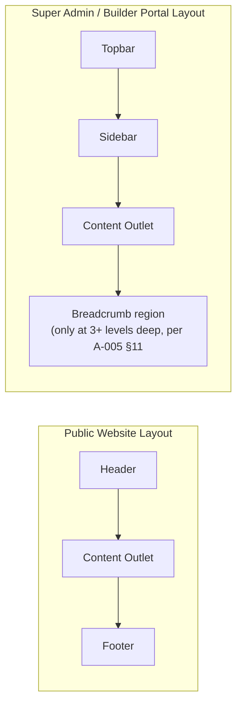
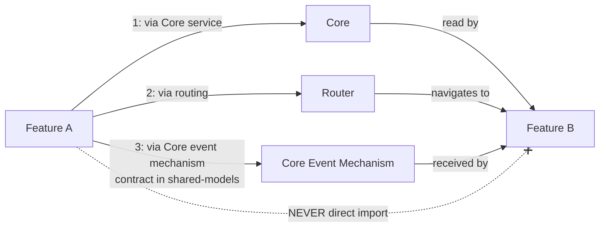
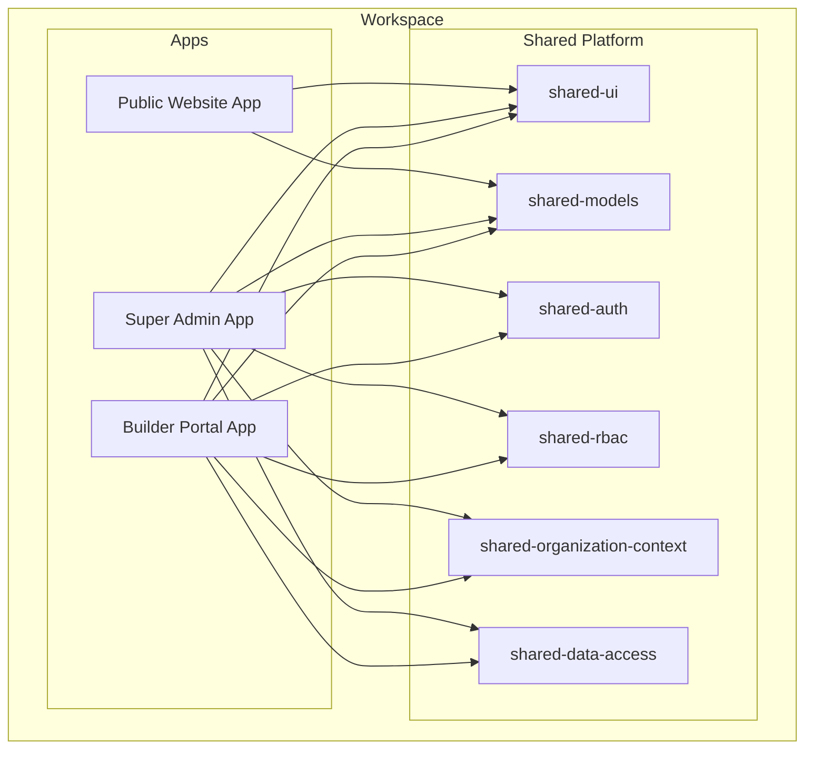
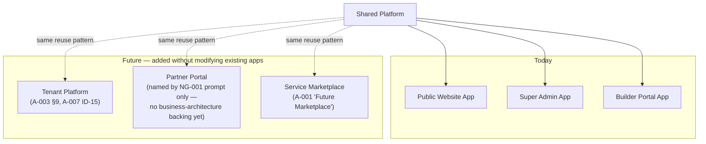

# NG-001 — Angular Enterprise Architecture Diagrams

**Companion to:** [`../NG-001_Angular_Enterprise_Architecture.md`](../NG-001_Angular_Enterprise_Architecture.md)

---

## 1. Enterprise Angular Architecture (top level)

---

## 2. Application Layer Diagram

---

## 3. Feature Boundary Diagram

Dashed crossed-out lines indicate the forbidden direct path; the only real path between features is through Core.

---

## 4. Dependency Diagram

---

## 5. Shell Architecture

---

## 6. Layout Architecture

---

## 7. Cross Module Communication

---

## 8. Platform Architecture

---

## 9. Future Expansion Model

