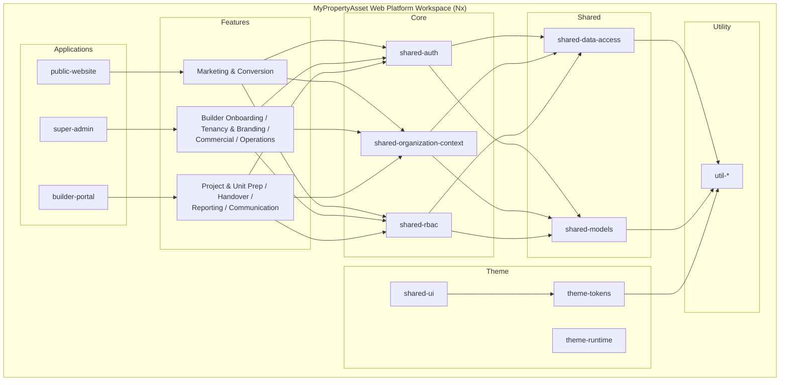
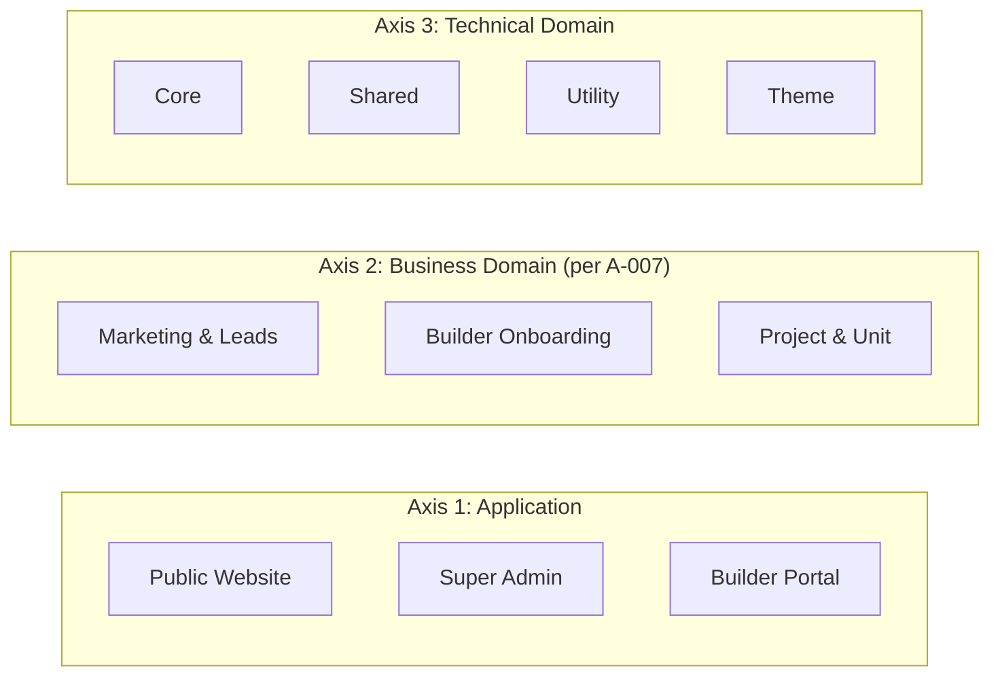
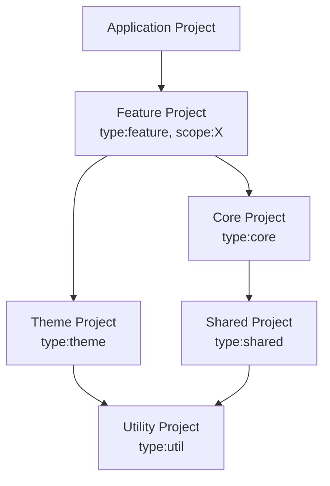
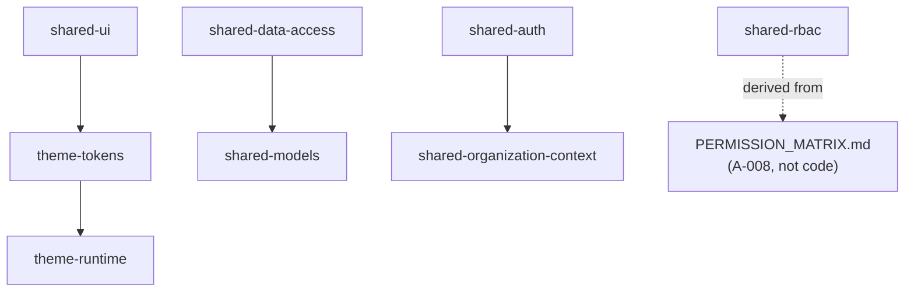
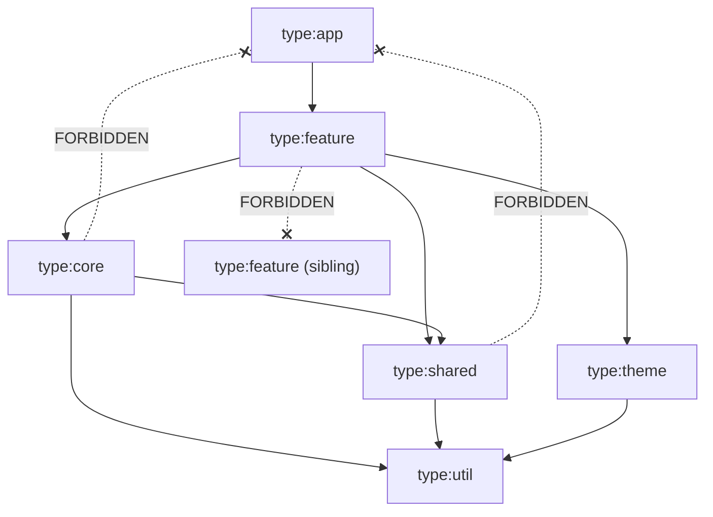
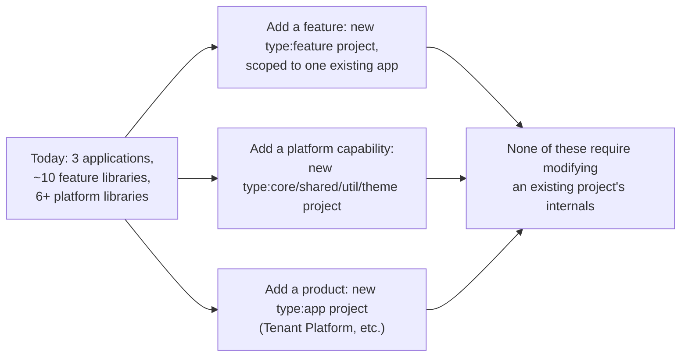
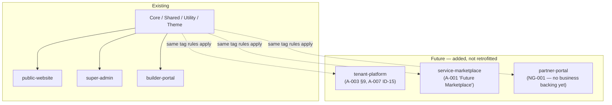

# NG-002 — Workspace Diagrams

**Companion to:** [`../NG-002_Angular_Workspace_Architecture.md`](../NG-002_Angular_Workspace_Architecture.md)

---

## 1. Workspace Architecture

---

## 2. Project Organization

---

## 3. Logical Project Structure

---

## 4. Library Relationships

---

## 5. Dependency Diagram (tag-enforced)

---

## 6. Workspace Expansion Strategy

---

## 7. Future Product Integration

