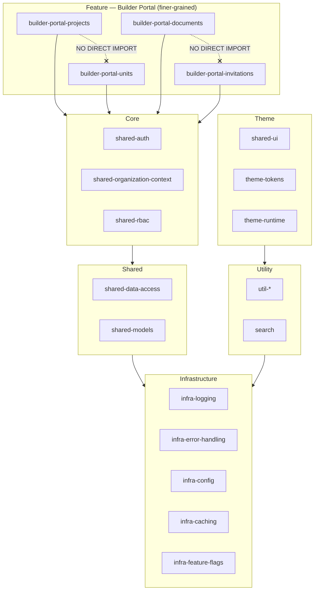
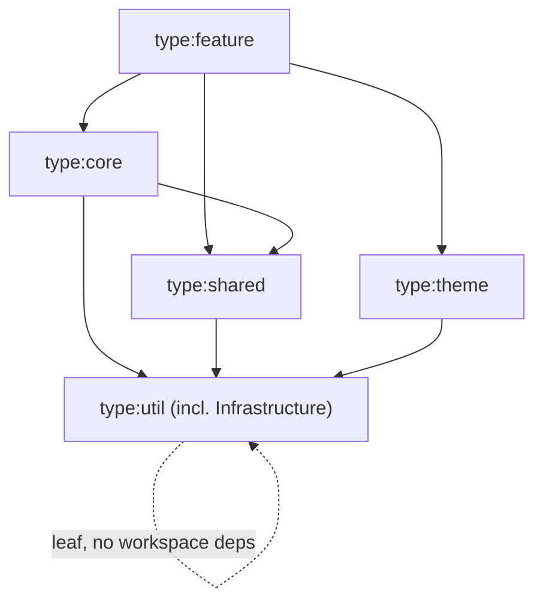
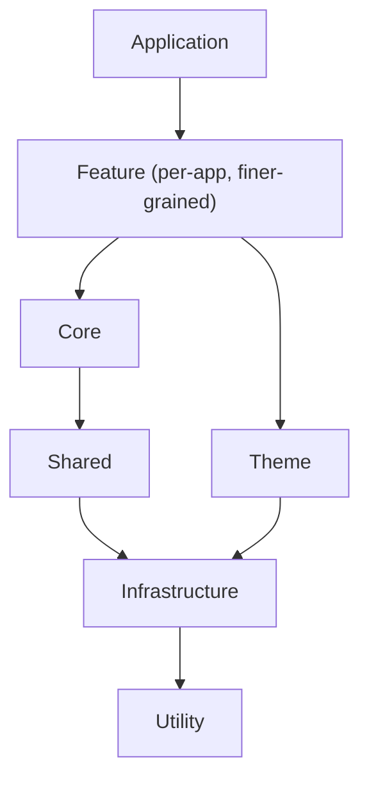
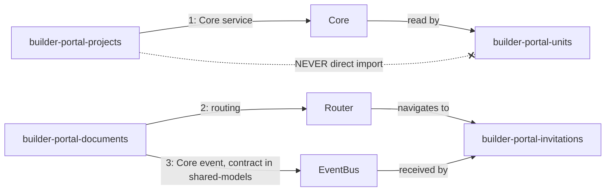
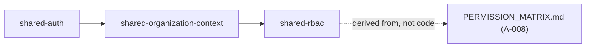
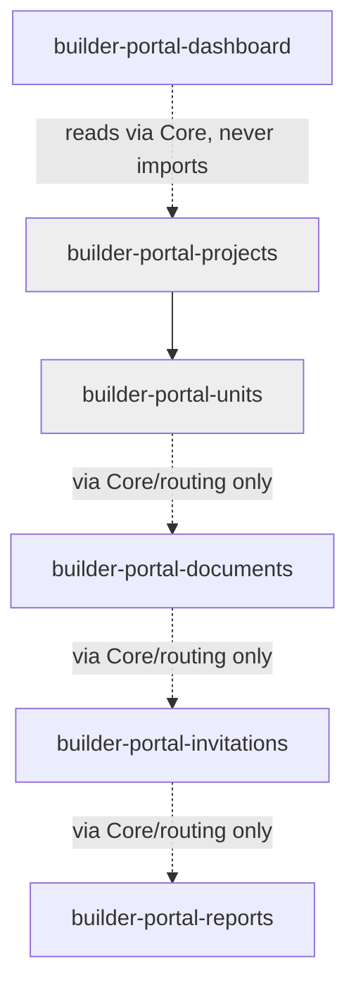
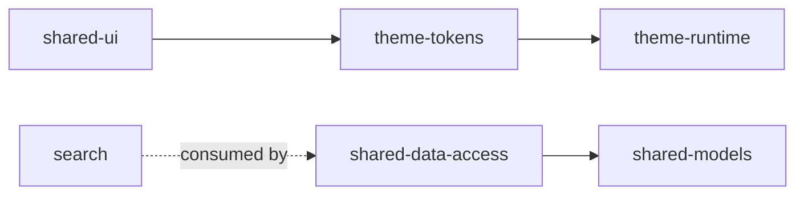
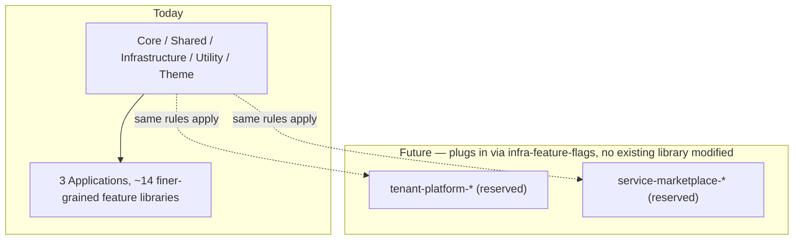

# NG-003 — Library Diagrams

**Companion to:** [`../NG-003_Angular_Library_Architecture.md`](../NG-003_Angular_Library_Architecture.md)

---

## 1. Package Architecture

---

## 2. Library Dependency Diagram

---

## 3. Library Hierarchy

---

## 4. Package Communication

---

## 5. Core Library Relationships

---

## 6. Feature Library Relationships (Builder Portal, finer-grained)

Grey fill marks the two libraries that depend on the still-undesigned Builder Projects backend domain (10th consecutive document to carry this dependency).

---

## 7. Shared Library Relationships

---

## 8. Future Package Expansion

