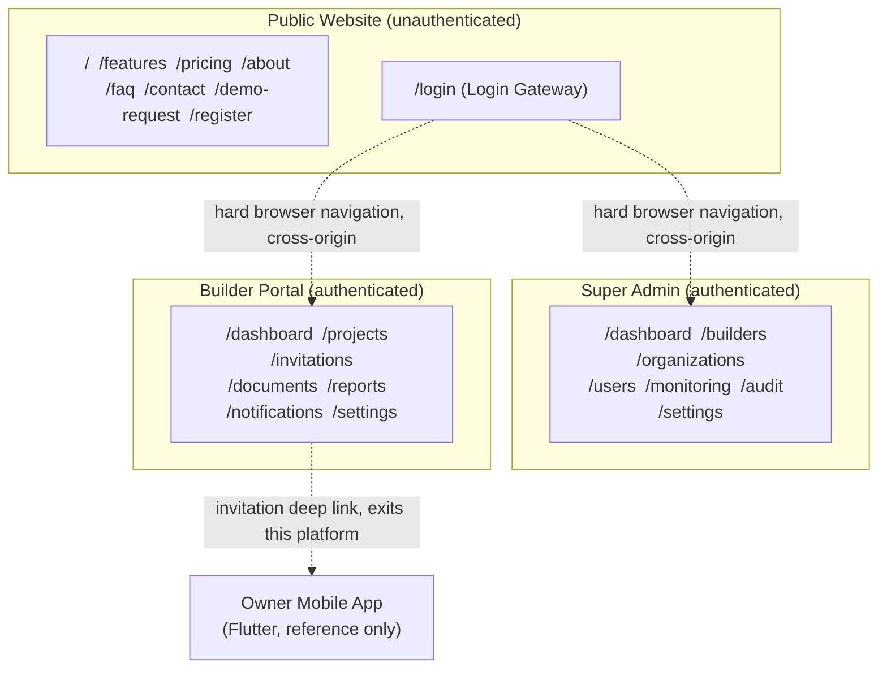
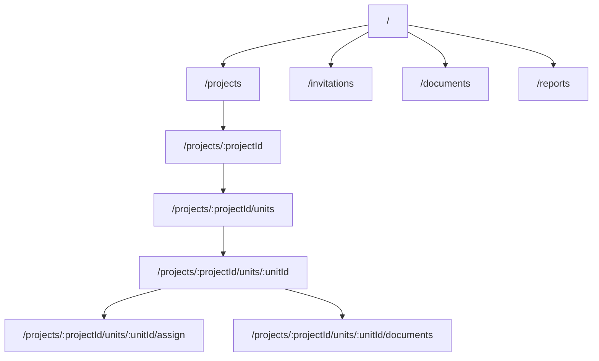
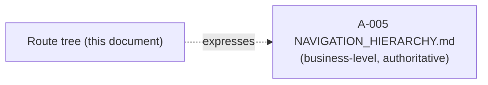
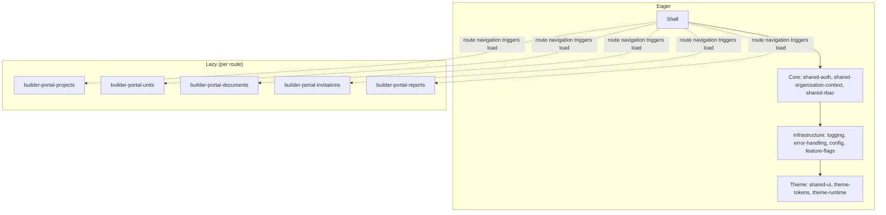
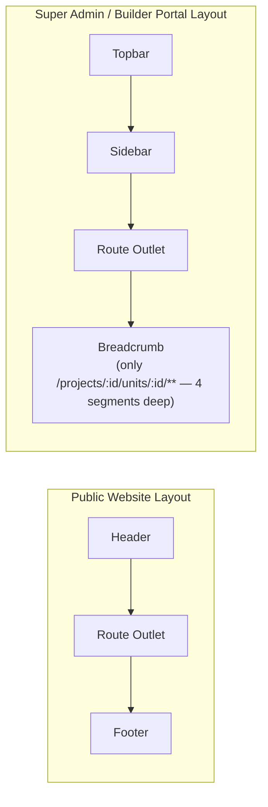
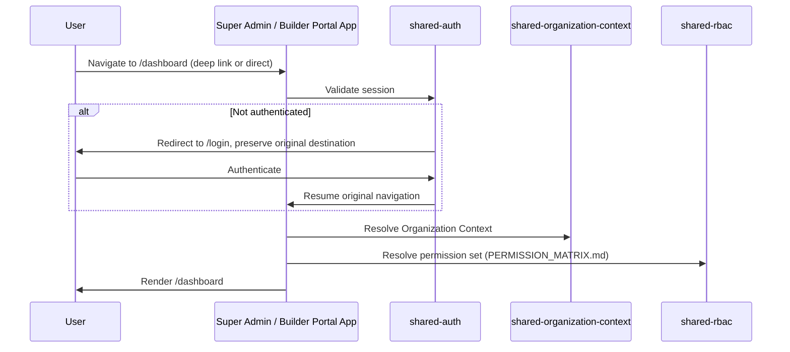
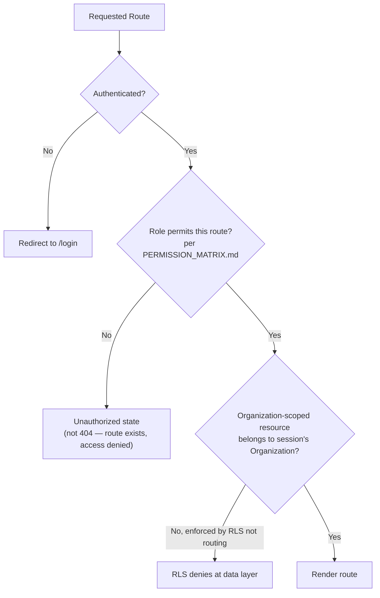
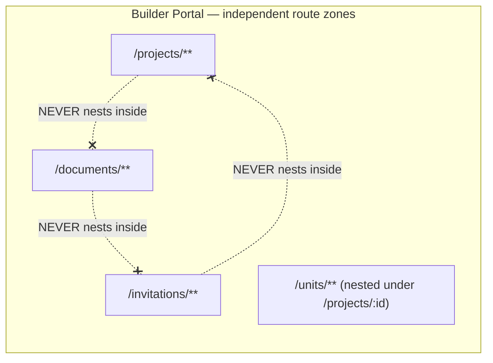
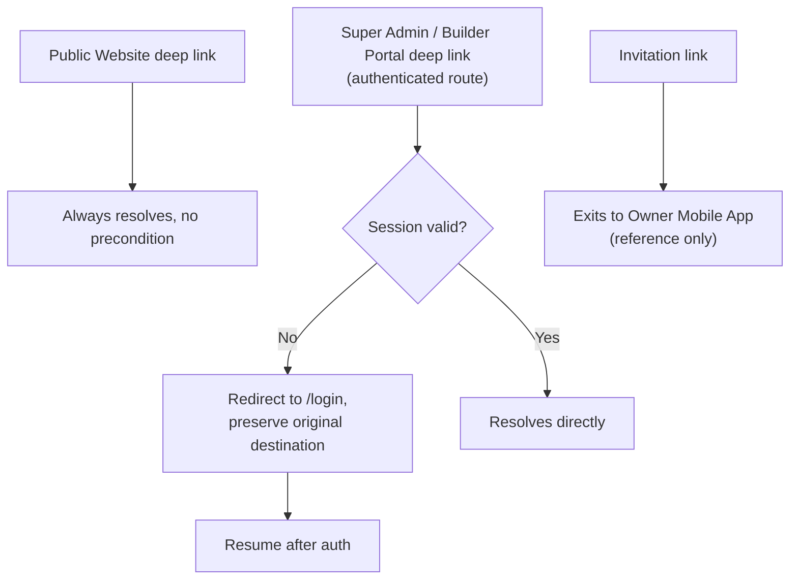

# NG-004 — Routing Diagrams

**Companion to:** [`../NG-004_Angular_Routing_Architecture.md`](../NG-004_Angular_Routing_Architecture.md)

---

## 1. Overall Routing Architecture

---

## 2. Application Route Hierarchy

---

## 3. Navigation Hierarchy

*(Route-level expression of A-005's business navigation hierarchy — see `NAVIGATION_ARCHITECTURE.md` §21 and A-005's own `NAVIGATION_HIERARCHY.md` for the authoritative business-level tree; not re-derived here.)*

---

## 4. Lazy Loading Diagram

---

## 5. Layout Architecture

---

## 6. Authentication Flow (routing-level)

---

## 7. Protected Route Diagram

---

## 8. Feature Route Boundaries

---

## 9. Deep Link Diagram

