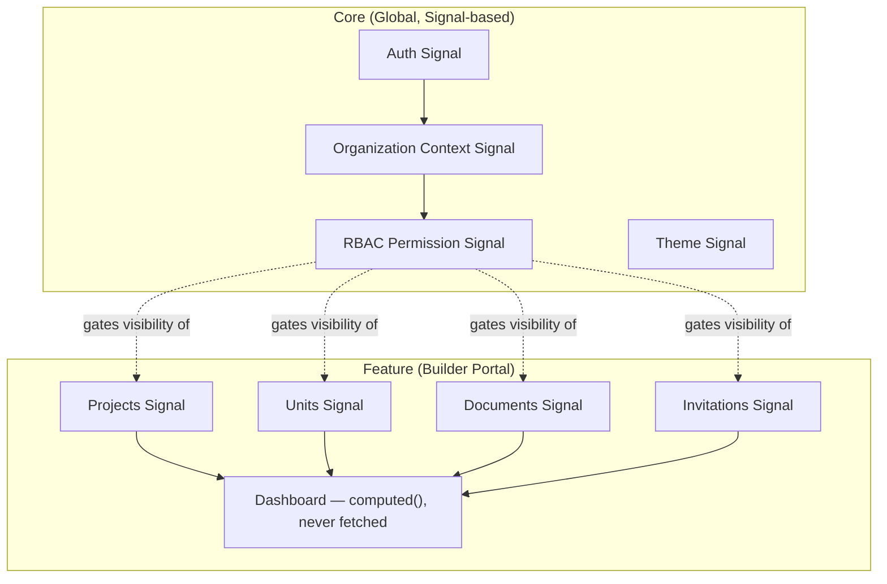
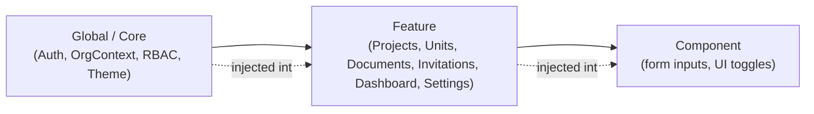
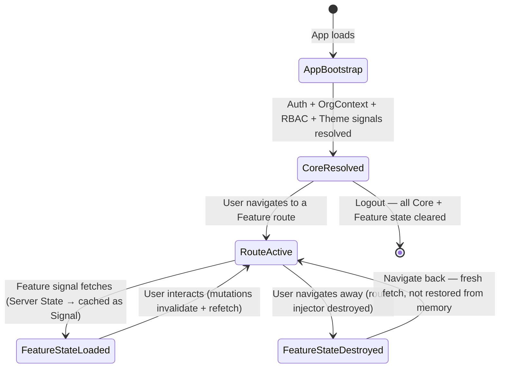
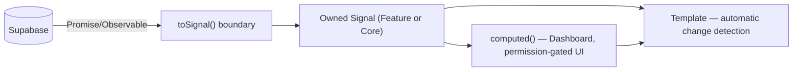
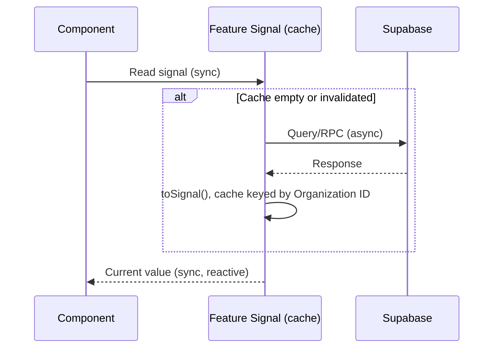
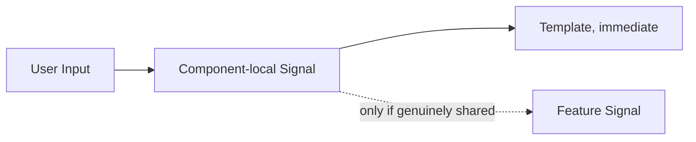
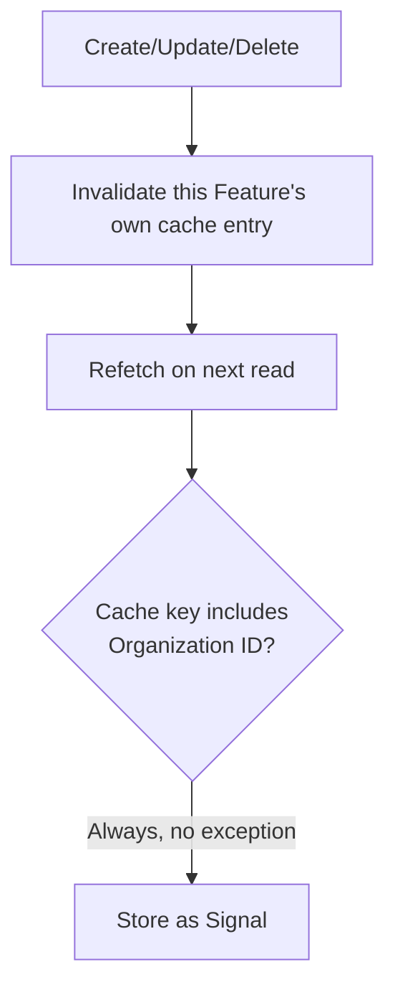
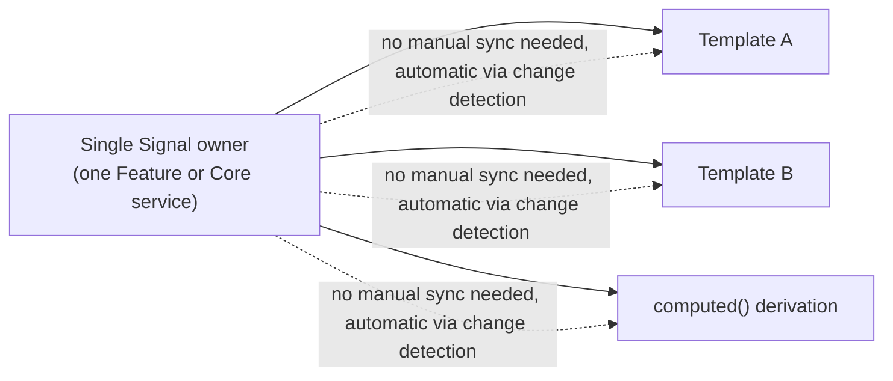

# NG-005 — State Diagrams

**Companion to:** [`../NG-005_State_Management_Strategy.md`](../NG-005_State_Management_Strategy.md)

---

## 1. Application State Map

---

## 2. State Ownership Diagram

---

## 3. State Lifecycle

---

## 4. Signals Flow

---

## 5. Server State Flow

---

## 6. Client State Flow

---

## 7. Cache Strategy

---

## 8. Synchronization Flow

