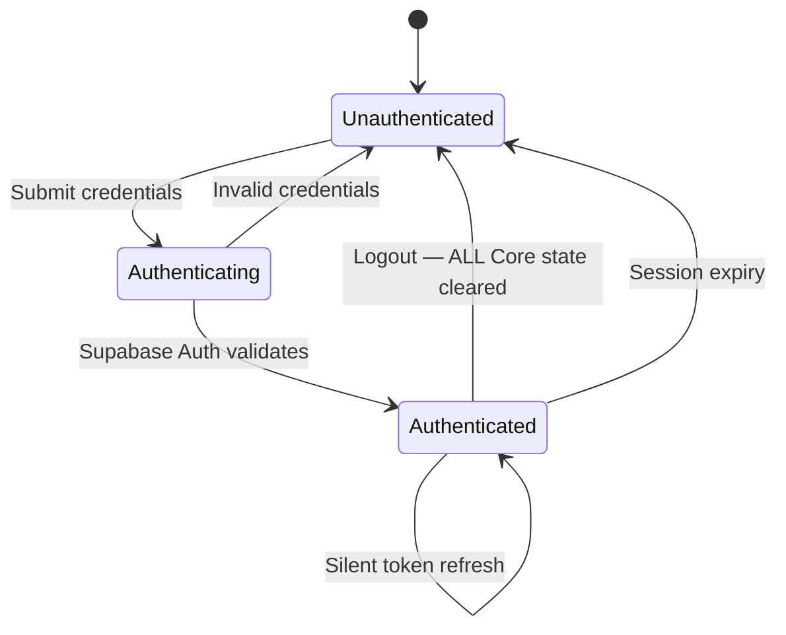
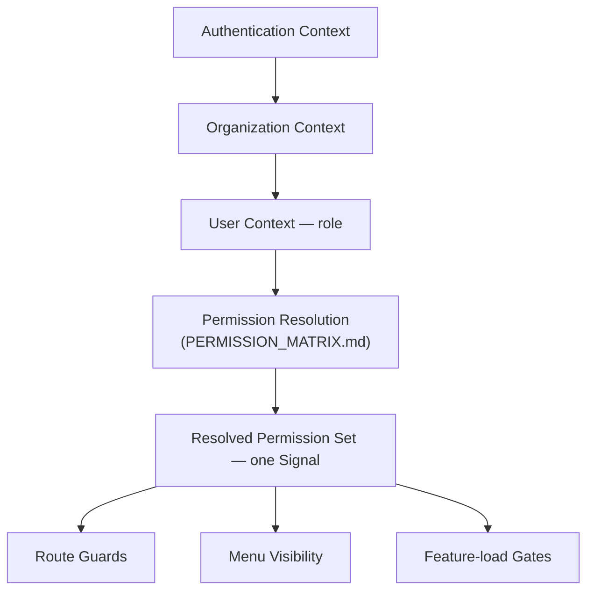
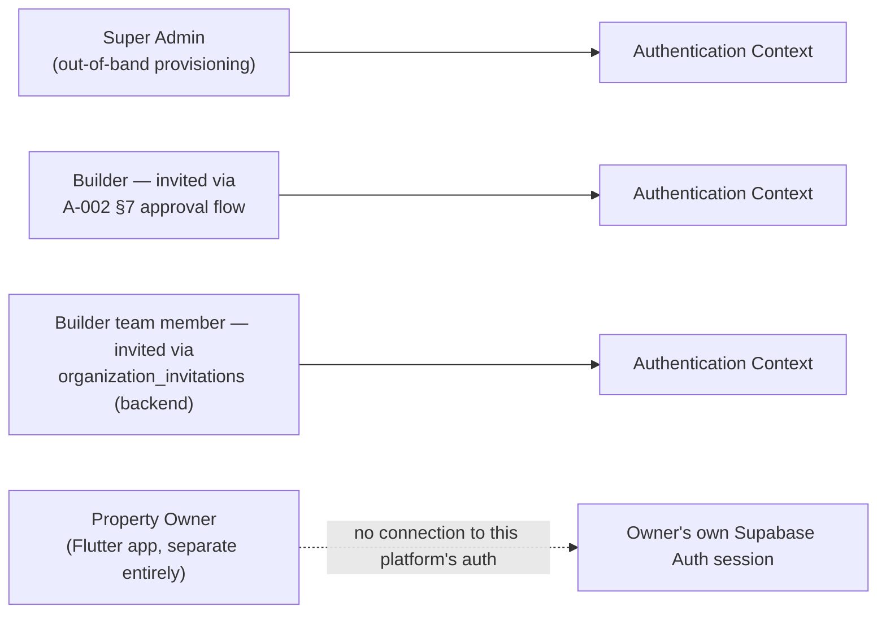
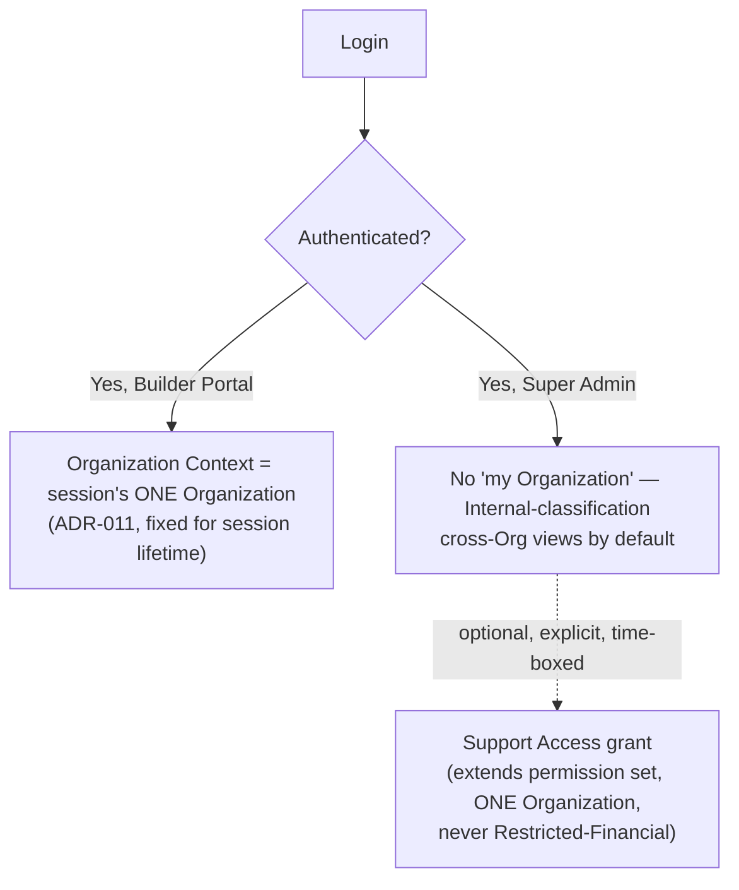
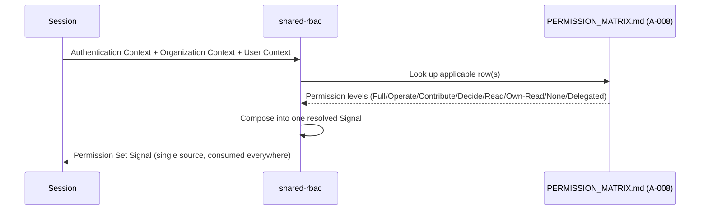
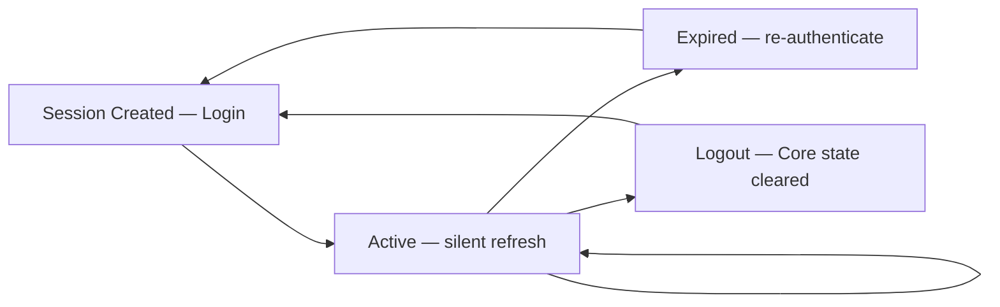
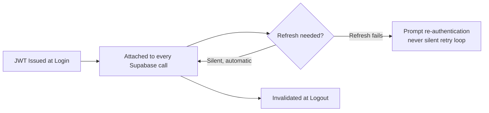
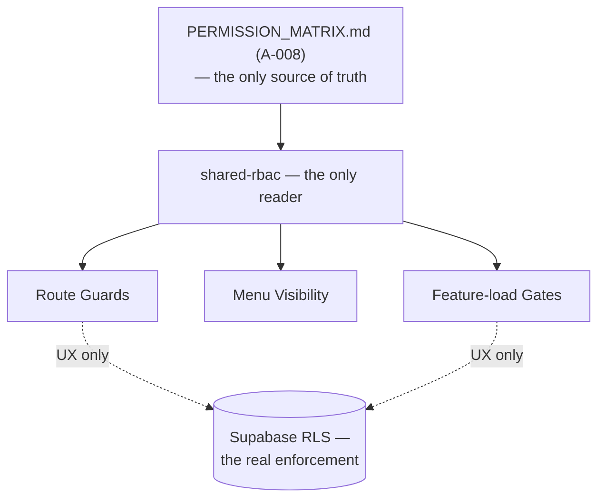
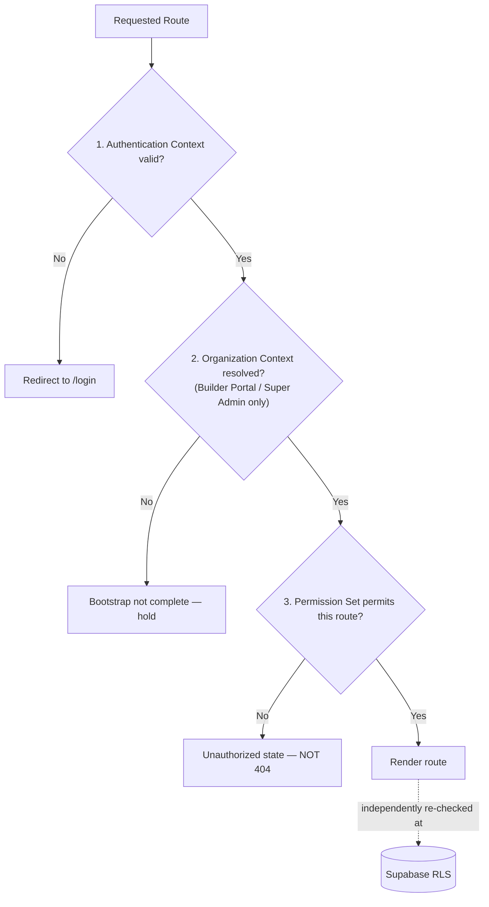

# NG-006 — Security Diagrams

**Companion to:** [`../NG-006_Authentication_Authorization_Architecture.md`](../NG-006_Authentication_Authorization_Architecture.md)

---

## 1. Authentication Lifecycle

---

## 2. Authorization Flow

---

## 3. Identity Flow

---

## 4. Organization Context Flow

---

## 5. Permission Resolution Flow

---

## 6. Session Lifecycle

---

## 7. Token Lifecycle

---

## 8. Security Context Diagram

```mermaid
flowchart TB
    subgraph "Public Visitor — all four layers absent"
        None[No context of any kind]
    end
    subgraph "Builder Session"
        BA1[Authentication Context] --> BA2["Organization Context\n(1 Org, fixed — ADR-011)"]
        BA2 --> BA3[User Context — Owner/Admin/Member]
        BA3 --> BA4[Permission Set]
    end
    subgraph "Super Admin Session"
        SA1[Authentication Context] --> SA2["Organization Context\n(none — cross-Org, Internal-classification)"]
        SA2 --> SA3[User Context — Super Admin]
        SA3 --> SA4[Permission Set]
        SA4 -.optional extension.-> SA5["+ Support Access\n(1 Org, time-boxed, audited,\nNEVER Restricted-Financial)"]
    end
```

---

## 9. RBAC Integration

---

## 10. Route Protection Model

