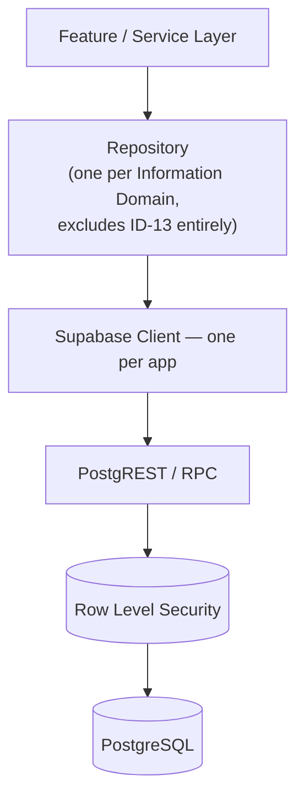
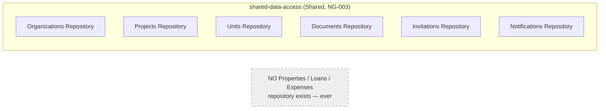
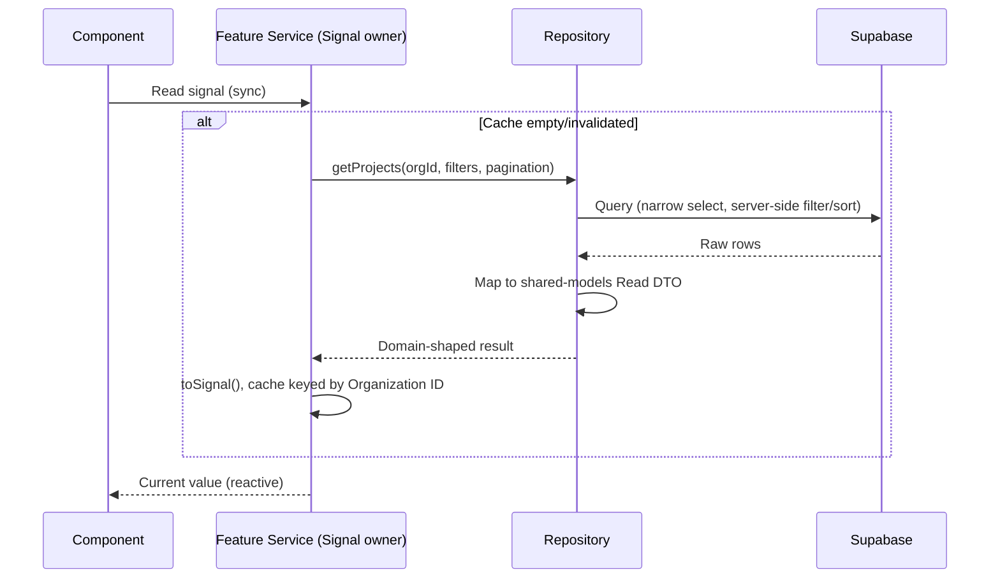
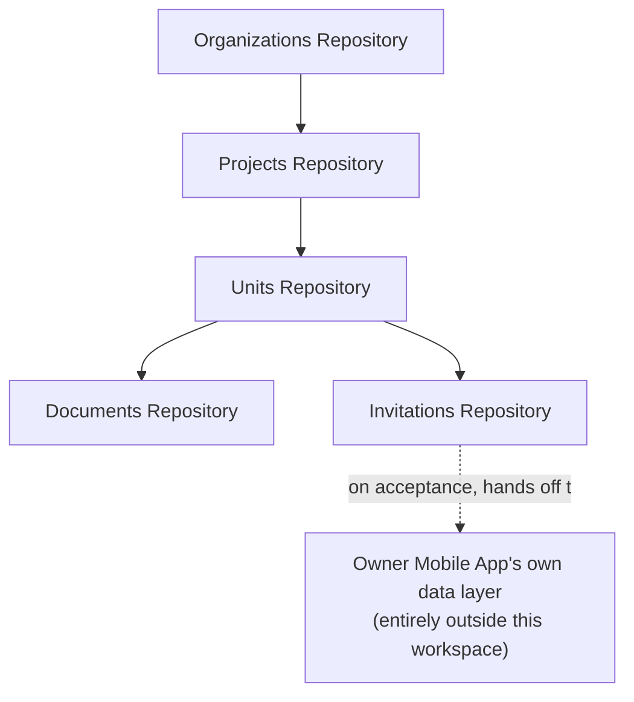
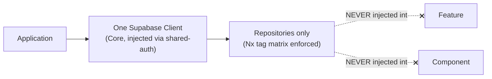
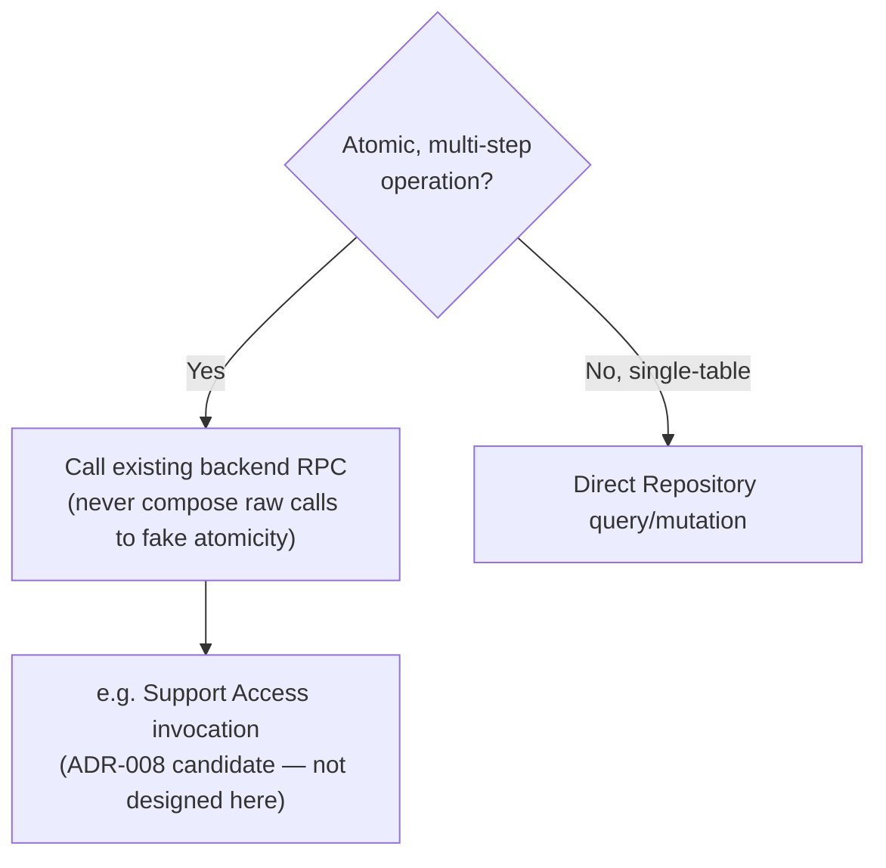
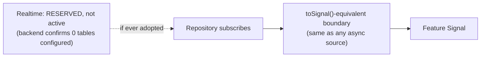
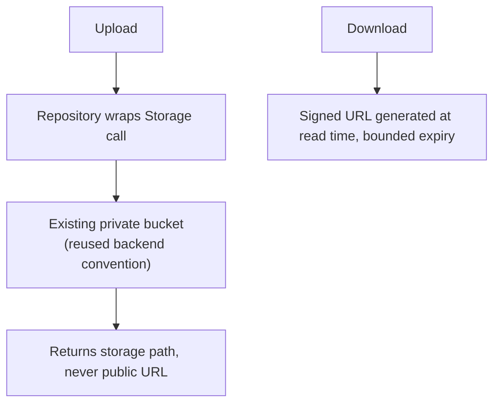
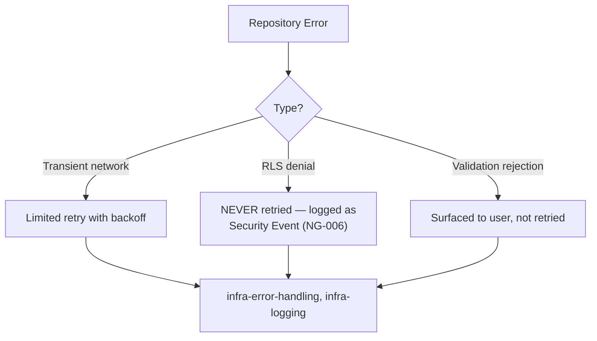
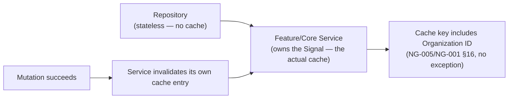

# NG-007 — API Diagrams

**Companion to:** [`../NG-007_API_Data_Access_Architecture.md`](../NG-007_API_Data_Access_Architecture.md)

---

## 1. API Architecture

---

## 2. Repository Architecture

---

## 3. Data Flow Diagram

---

## 4. Repository Relationships

---

## 5. Supabase Integration

---

## 6. RPC Flow

---

## 7. Realtime Flow

---

## 8. Storage Flow

---

## 9. Error Flow

---

## 10. Caching Flow

