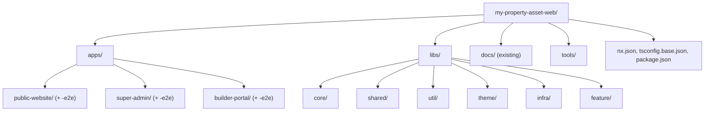
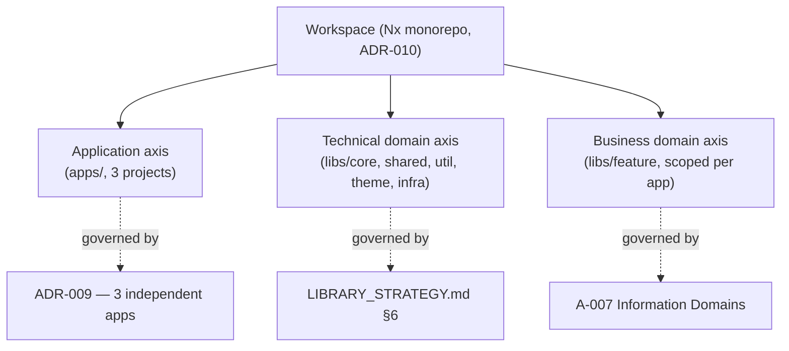
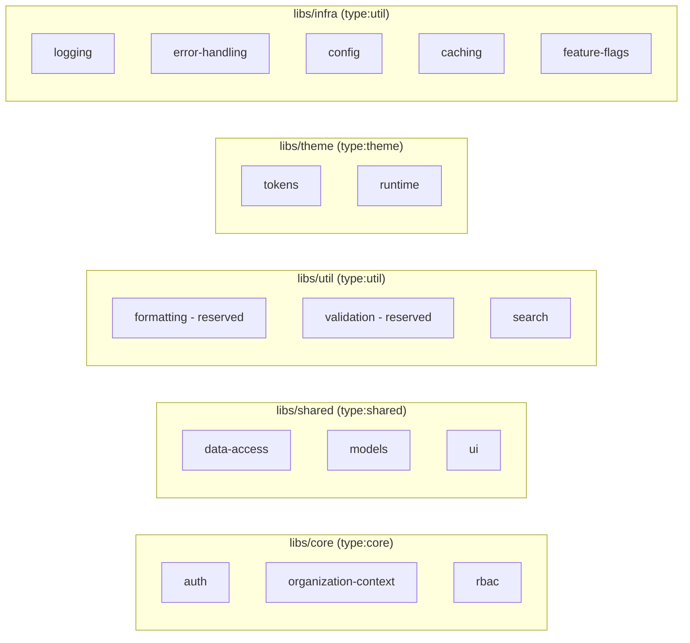
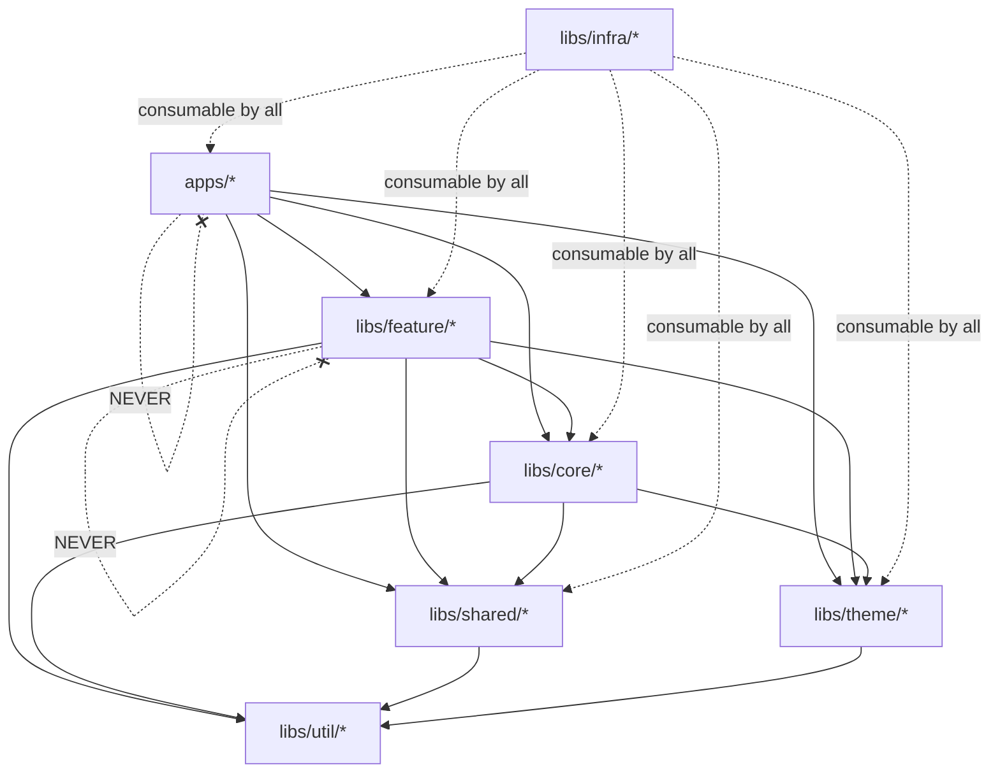
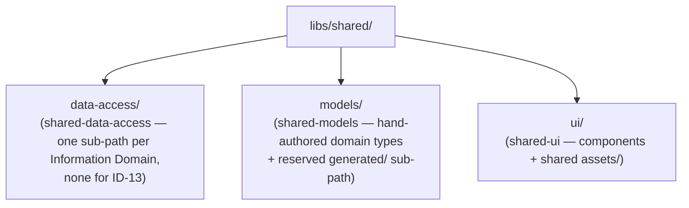
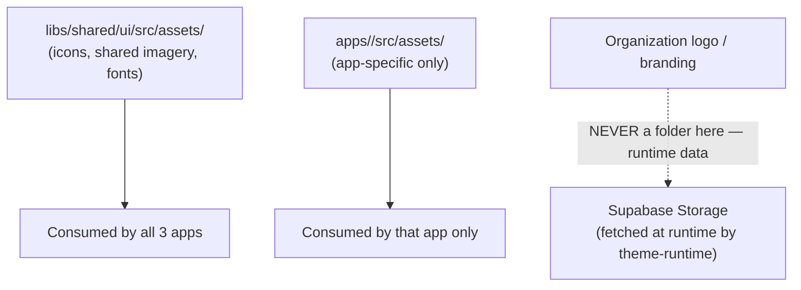
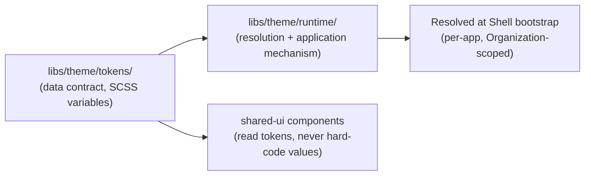
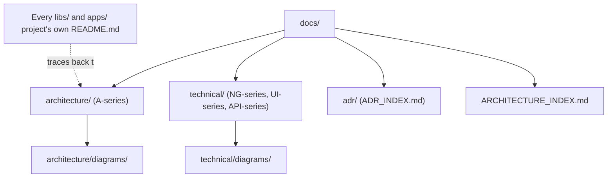

# NG-008 — Source Tree Diagrams

**Companion to:** [`../NG-008_Folder_Structure_Architecture.md`](../NG-008_Folder_Structure_Architecture.md)

---

## 1. Complete Source Tree

---

## 2. Workspace Hierarchy

---

## 3. Feature Hierarchy

```mermaid
flowchart TB
    FeatureRoot["libs/feature/"] --> PWF["public-website/"]
    FeatureRoot --> SAF["super-admin/"]
    FeatureRoot --> BPF["builder-portal/"]

    PWF --> PW1["marketing-conversion/"]

    SAF --> SA1["builder-onboarding/"]
    SAF --> SA2["tenancy-branding/"]
    SAF --> SA3["commercial/"]
    SAF --> SA4["operations/"]
    SAF --> SA5["audit/ (gap-flagged)"]
    SAF --> SA6["users/ (gap-flagged)"]
    SAF --> SA7["dashboard/ (computed()-only)"]
    SAF --> SA8["settings/"]
    SAF --> SA9["communication/"]

    BPF --> BP1["projects/ (backend-dependent)"]
    BPF --> BP2["units/ (backend-dependent)"]
    BPF --> BP3["documents/"]
    BPF --> BP4["invitations/"]
    BPF --> BP5["reporting/"]
    BPF --> BP6["dashboard/ (computed()-only)"]
    BPF --> BP7["settings/"]
    BPF --> BP8["communication/"]

    NoProperty["NO properties/, loans/, expenses/\nanywhere in this tree"]
    style NoProperty fill:#eee,stroke-dasharray: 5 5
```

---

## 4. Library Placement

---

## 5. Folder Dependency Diagram

---

## 6. Shared Folder Structure

---

## 7. Asset Structure

---

## 8. Theme Structure

---

## 9. Documentation Structure

