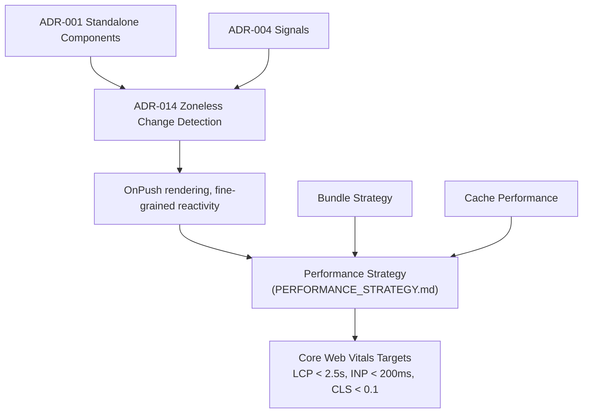
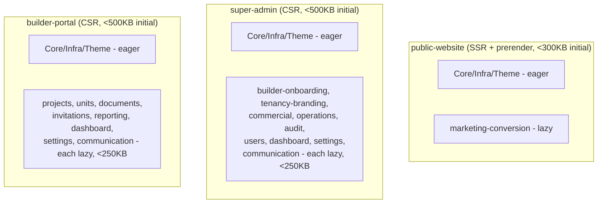
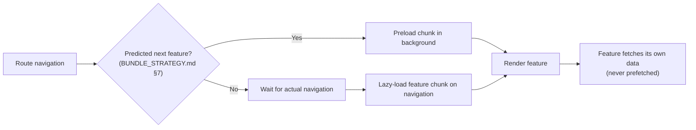
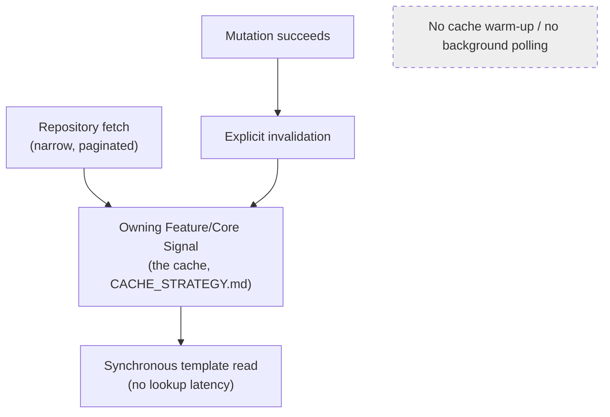
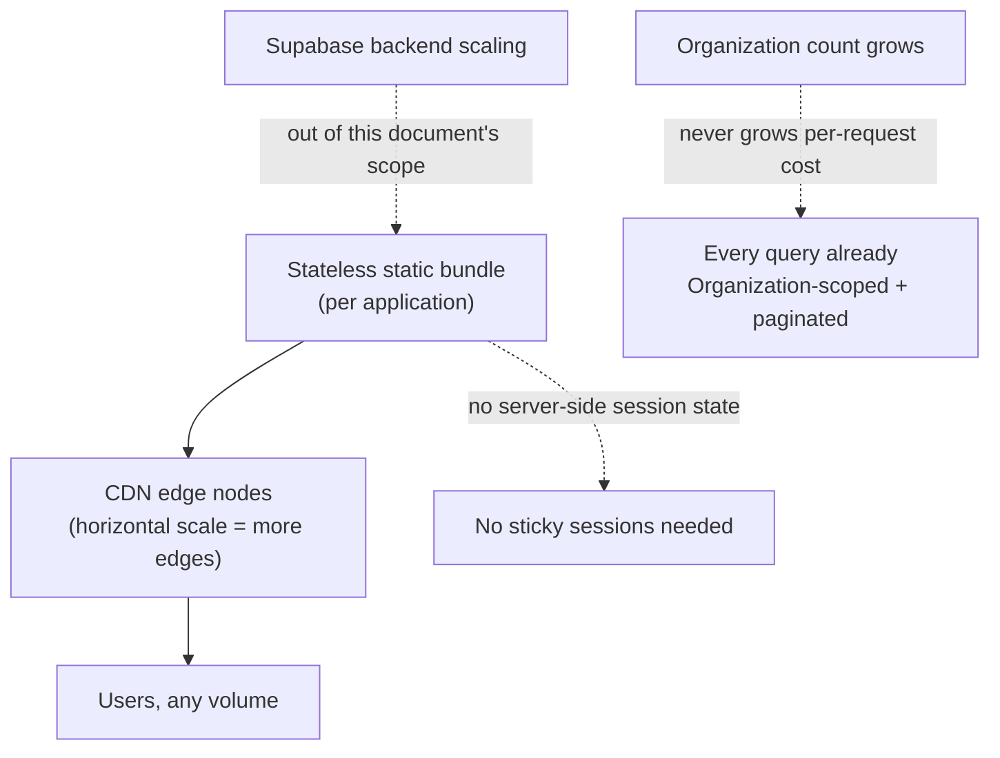
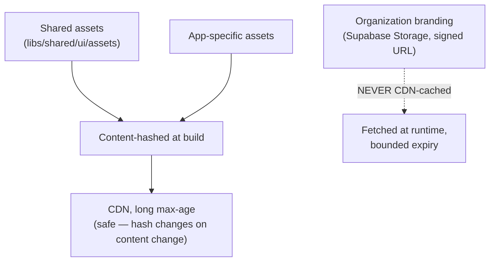
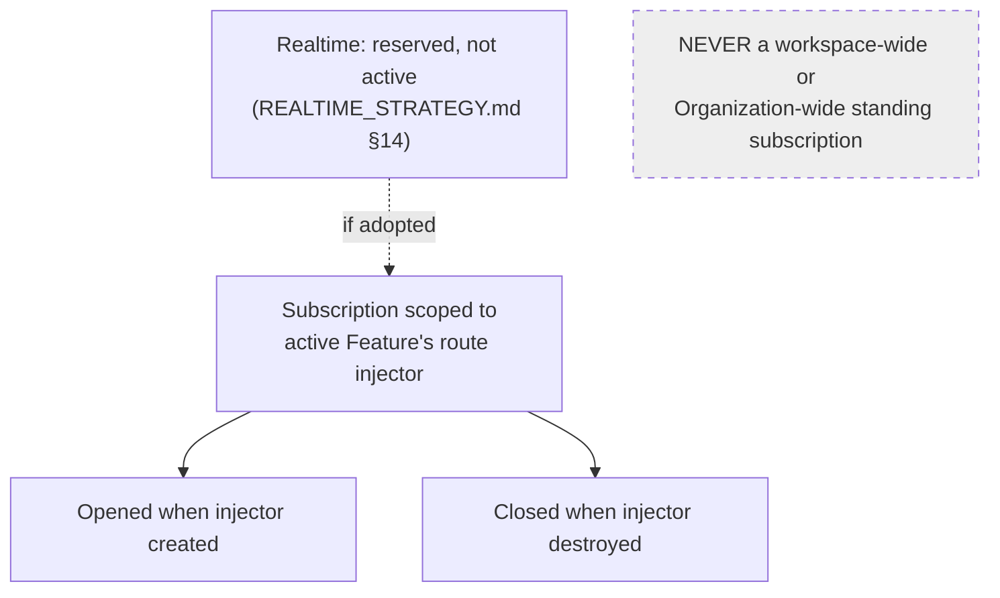
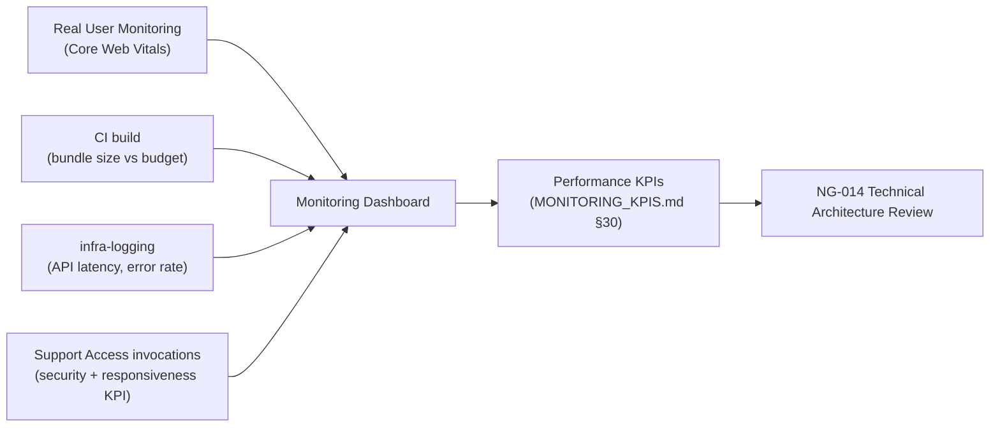

# NG-009 — Performance Diagrams

**Companion to:** [`../NG-009_Performance_Scalability_Architecture.md`](../NG-009_Performance_Scalability_Architecture.md)

---

## 1. Performance Architecture

---

## 2. Bundle Strategy

---

## 3. Loading Strategy

---

## 4. Caching Strategy

---

## 5. Scalability Model

---

## 6. Asset Delivery Model

---

## 7. Realtime Architecture

---

## 8. Performance Monitoring Flow

