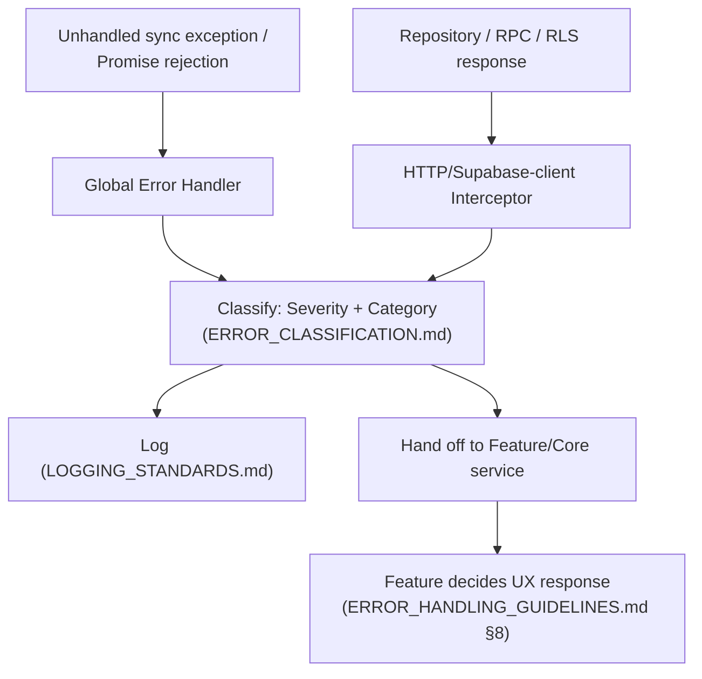
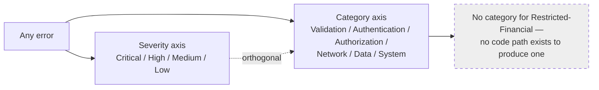
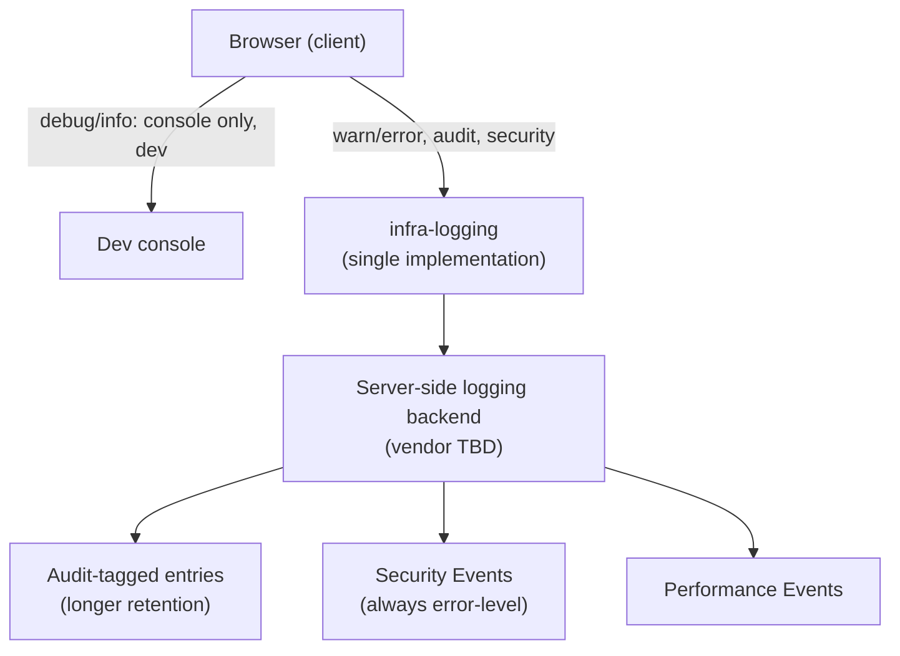
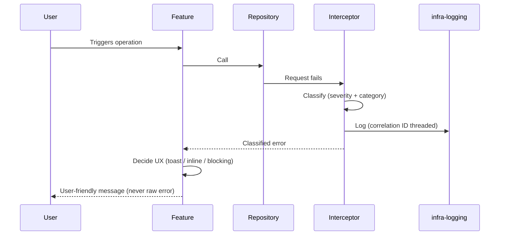
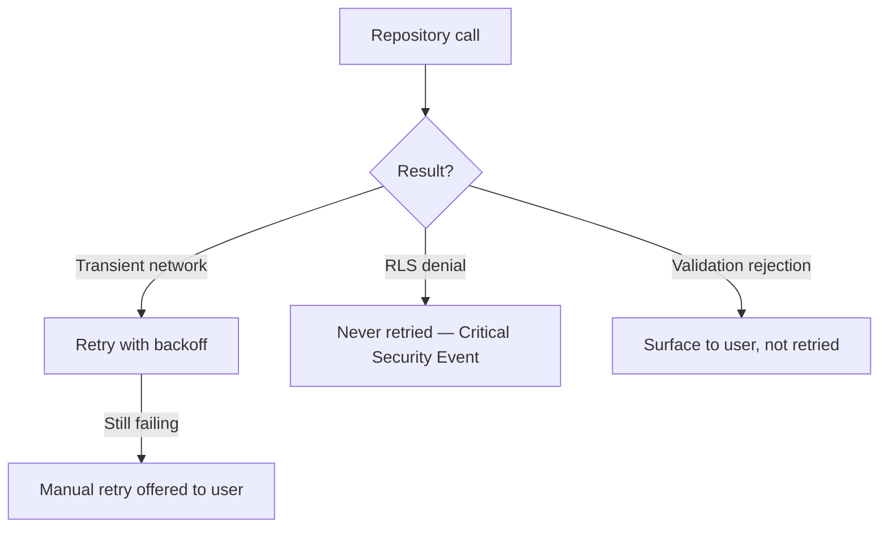
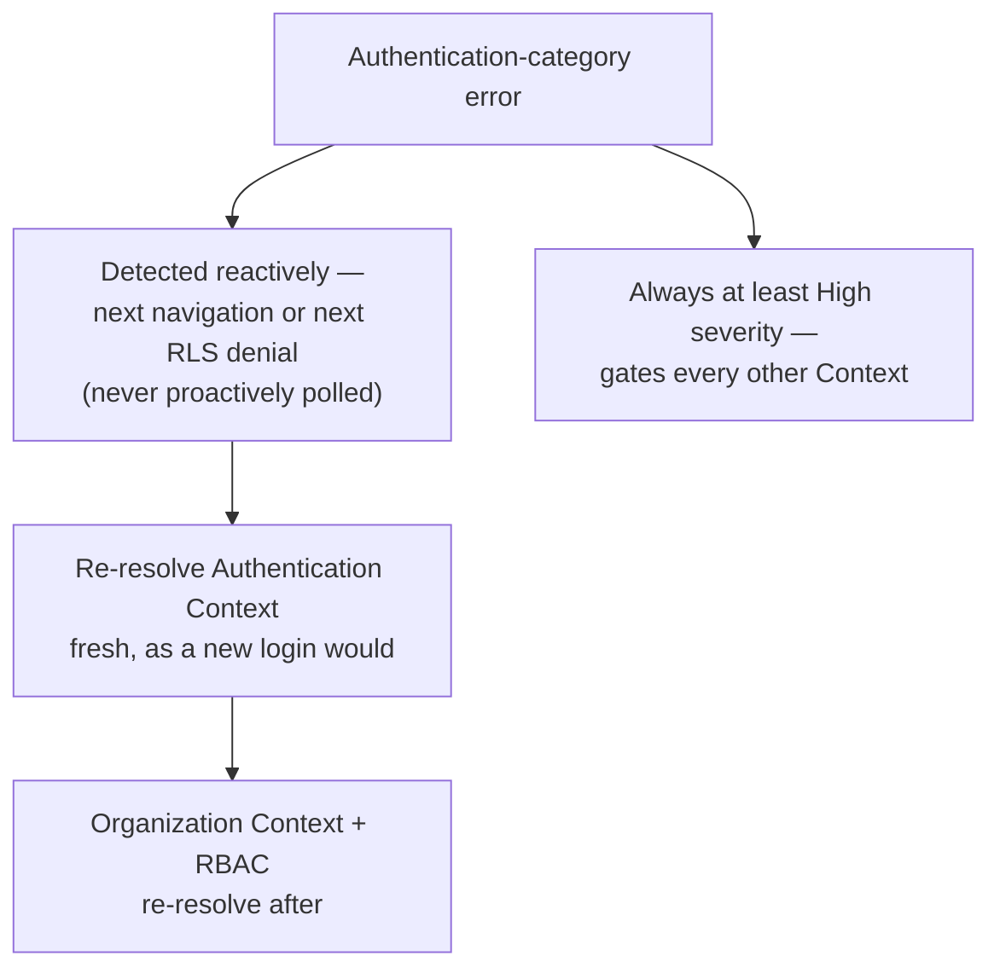
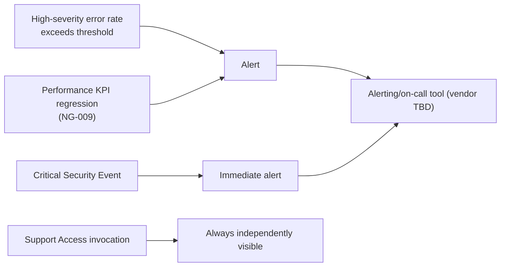
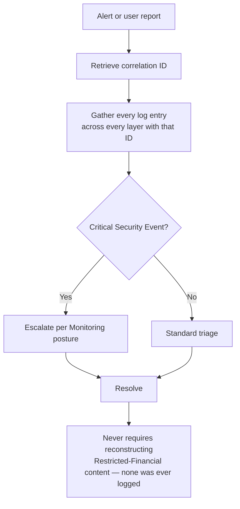

# NG-010 — Error Architecture Diagrams

**Companion to:** [`../NG-010_Error_Handling_Logging_Architecture.md`](../NG-010_Error_Handling_Logging_Architecture.md)

---

## 1. Global Error Flow

---

## 2. Error Classification Model

---

## 3. Logging Architecture

---

## 4. Error Lifecycle

---

## 5. API Error Flow

---

## 6. Authentication Error Flow

---

## 7. Monitoring Integration

---

## 8. Incident Response Flow

