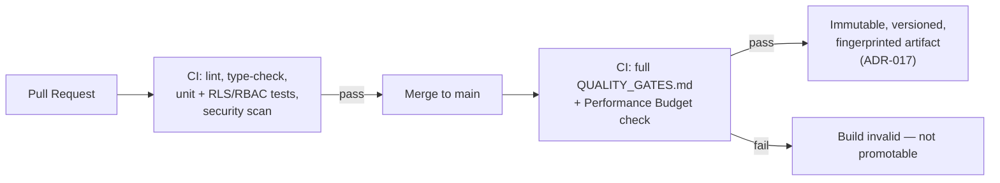
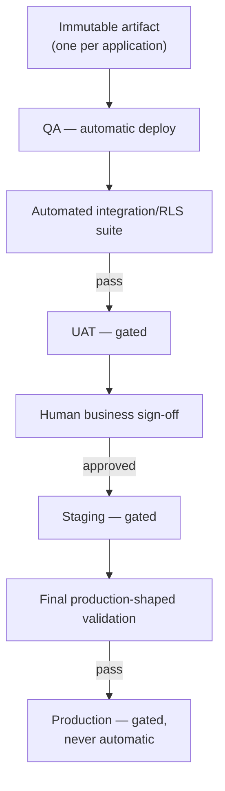
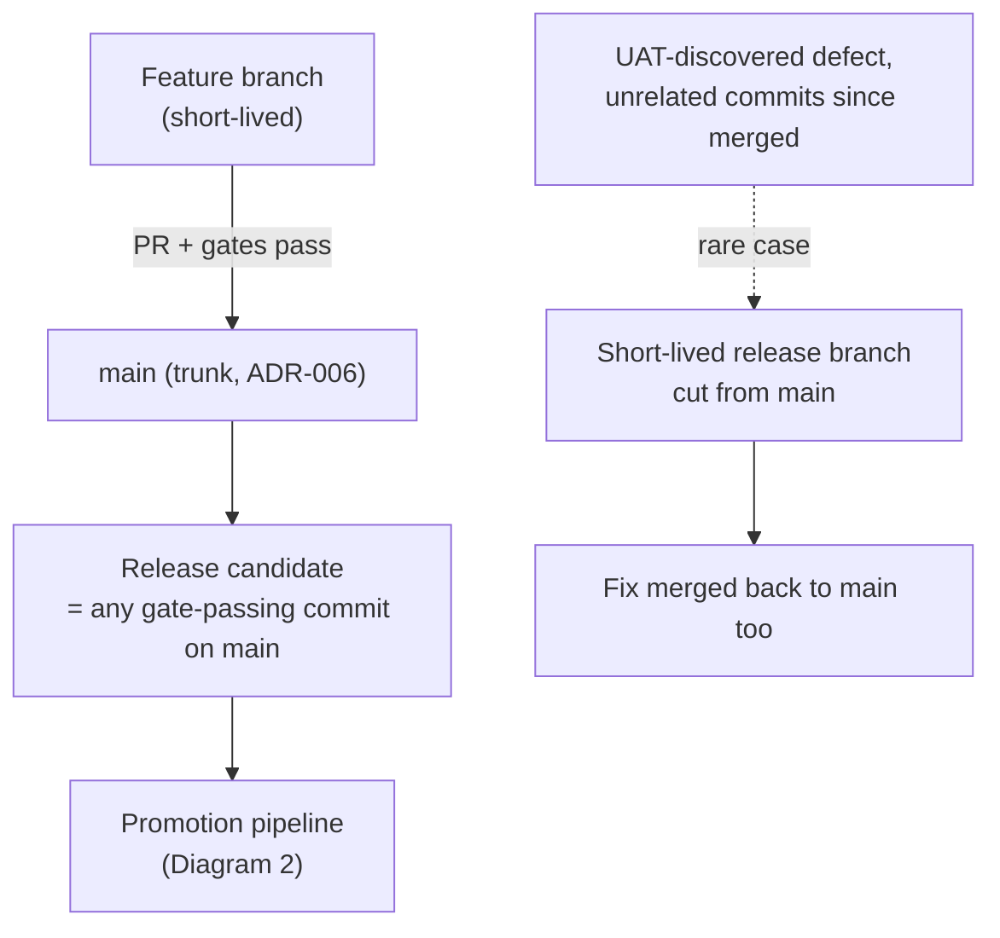
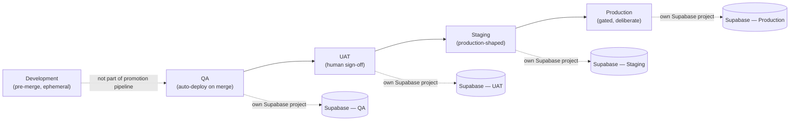
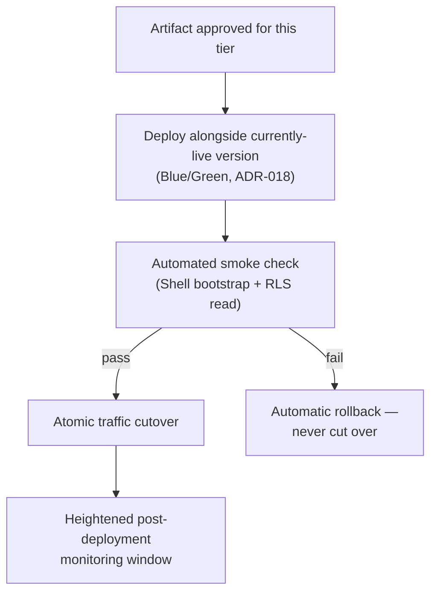
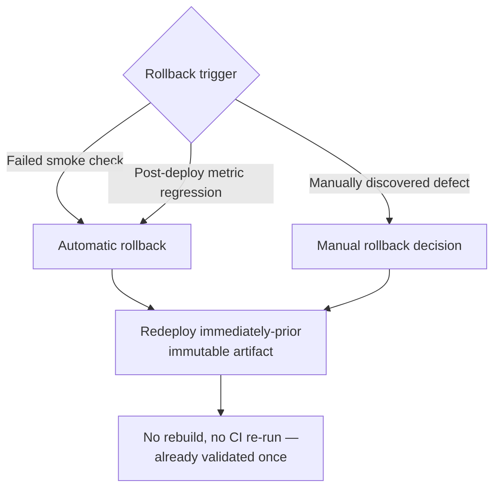
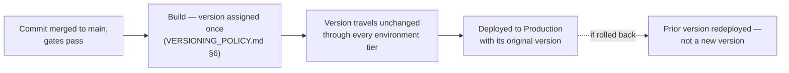
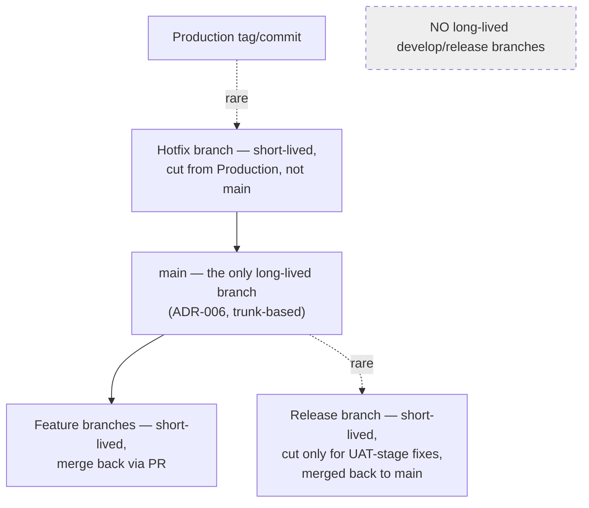

# NG-011 — Deployment Diagrams

**Companion to:** [`../NG-011_Build_Release_Deployment_Architecture.md`](../NG-011_Build_Release_Deployment_Architecture.md)

---

## 1. Build Pipeline

---

## 2. CI/CD Pipeline

---

## 3. Release Workflow

---

## 4. Environment Promotion Flow

---

## 5. Deployment Workflow

---

## 6. Rollback Workflow

---

## 7. Version Lifecycle

---

## 8. Branch Strategy

