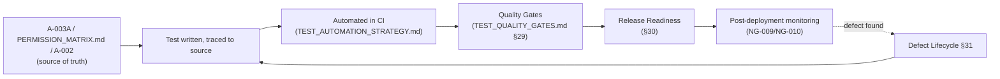
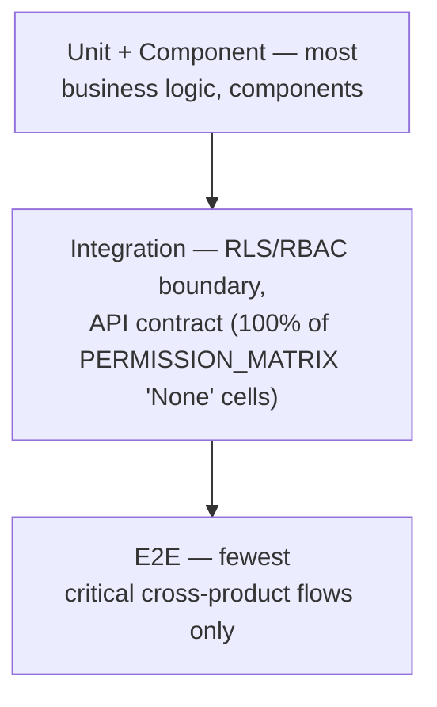
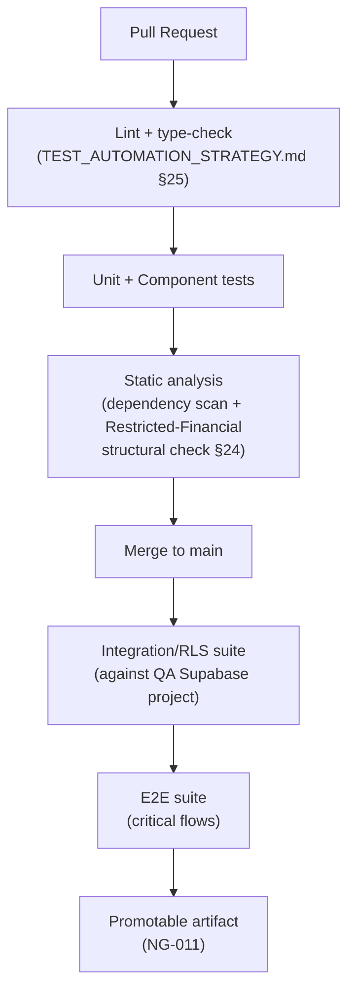
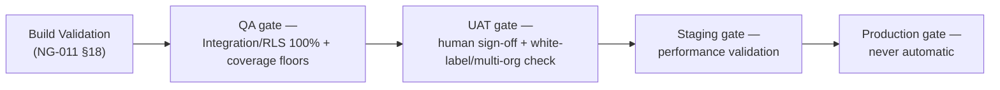
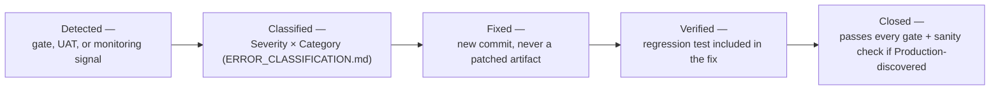
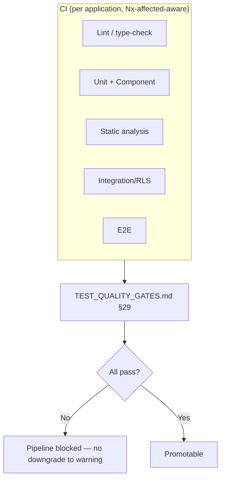
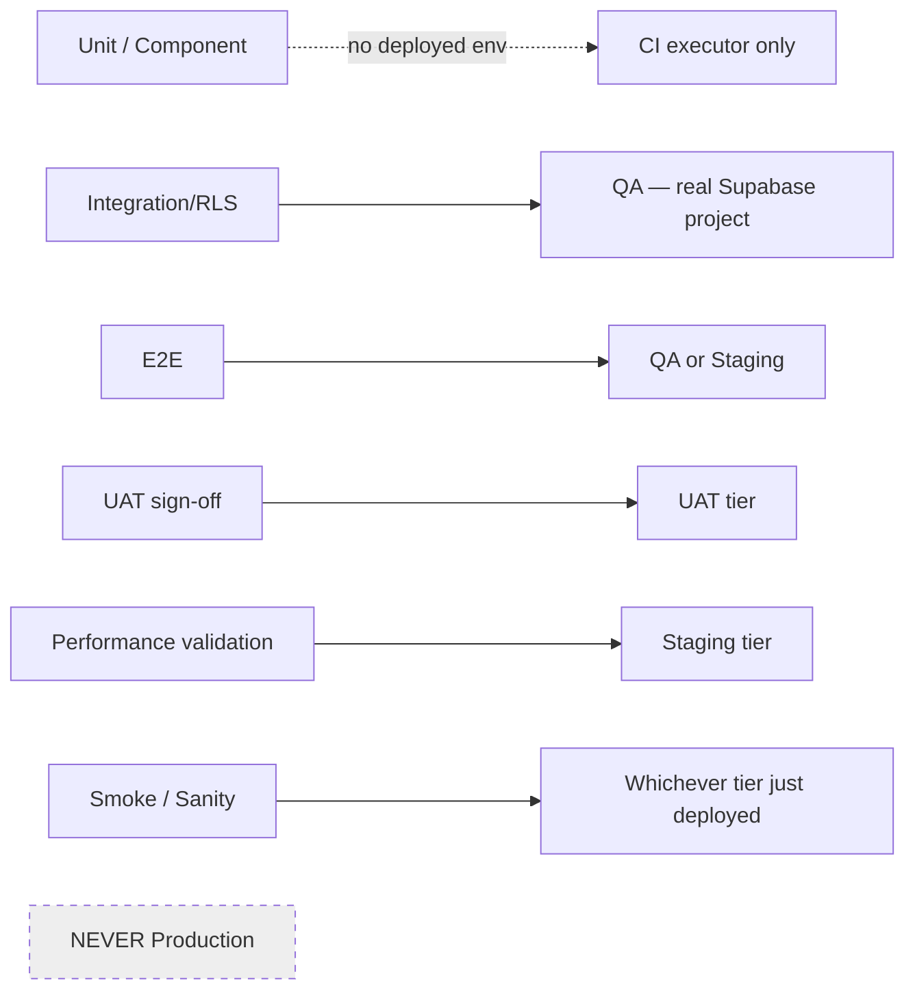
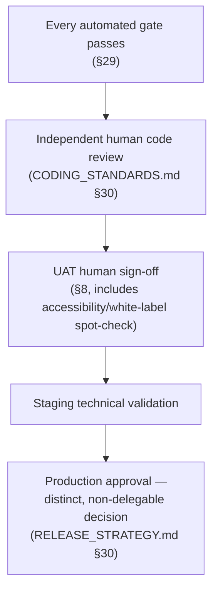

# NG-012 — Testing Diagrams

**Companion to:** [`../NG-012_Quality_Engineering_Testing_Architecture.md`](../NG-012_Quality_Engineering_Testing_Architecture.md)

---

## 1. Quality Engineering Lifecycle

---

## 2. Testing Pyramid

---

## 3. CI Testing Flow

---

## 4. Release Quality Gates

---

## 5. Defect Lifecycle

---

## 6. Automation Architecture

---

## 7. Test Environment Flow

---

## 8. Quality Approval Workflow

