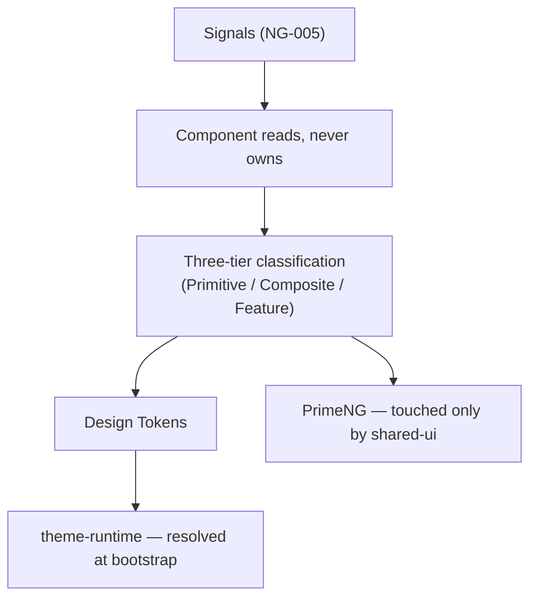
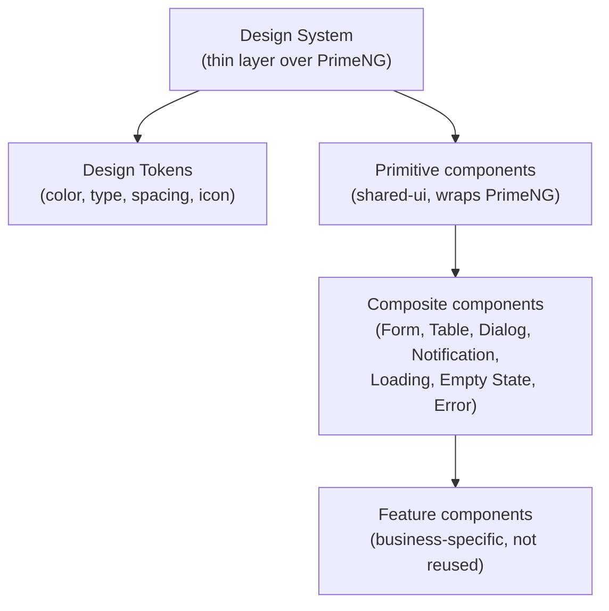
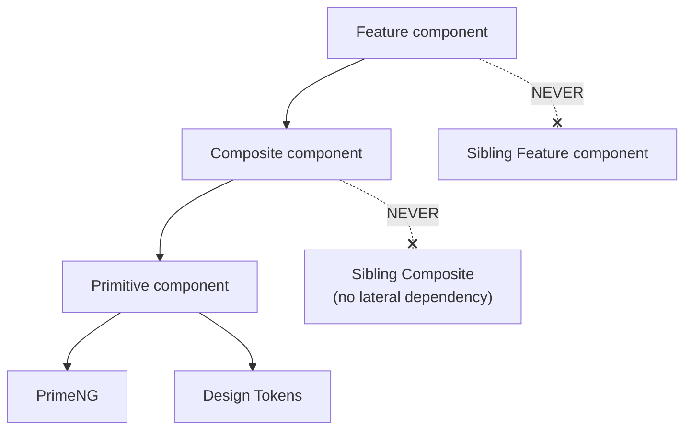
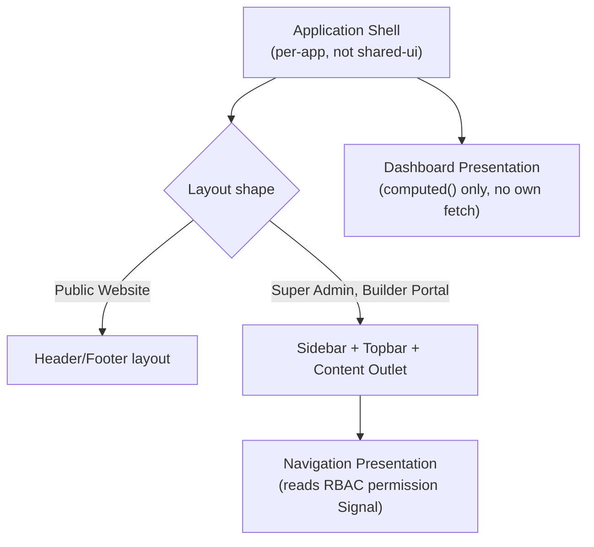
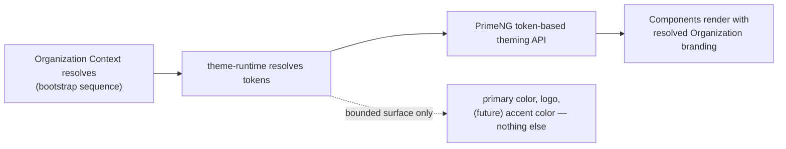
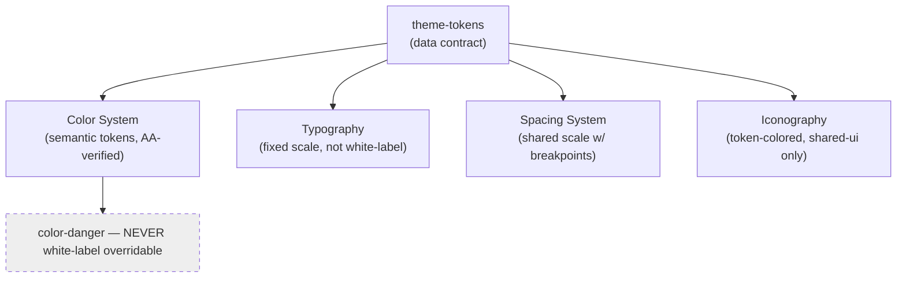
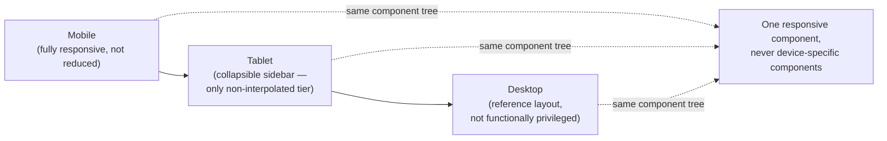
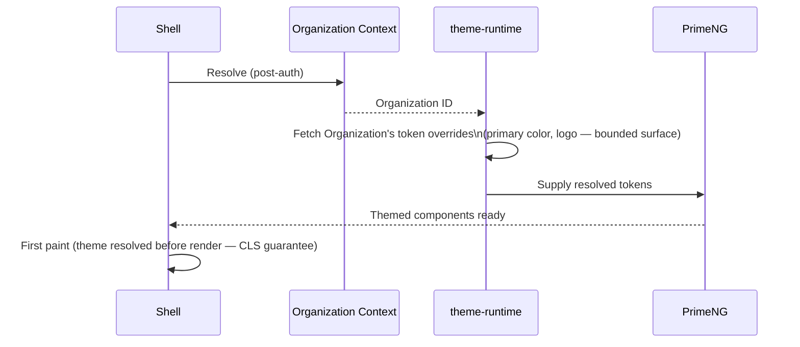

# NG-013 — Presentation Diagrams

**Companion to:** [`../NG-013_Frontend_Presentation_Architecture.md`](../NG-013_Frontend_Presentation_Architecture.md)

---

## 1. Presentation Architecture

---

## 2. Design System Hierarchy

---

## 3. Component Hierarchy

---

## 4. Layout Hierarchy

---

## 5. Theme Architecture

---

## 6. Design Token Relationships

---

## 7. Responsive Breakpoint Strategy

---

## 8. White-label Theme Flow

