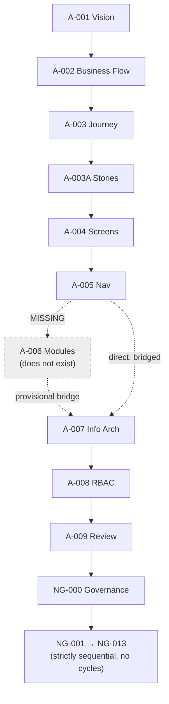
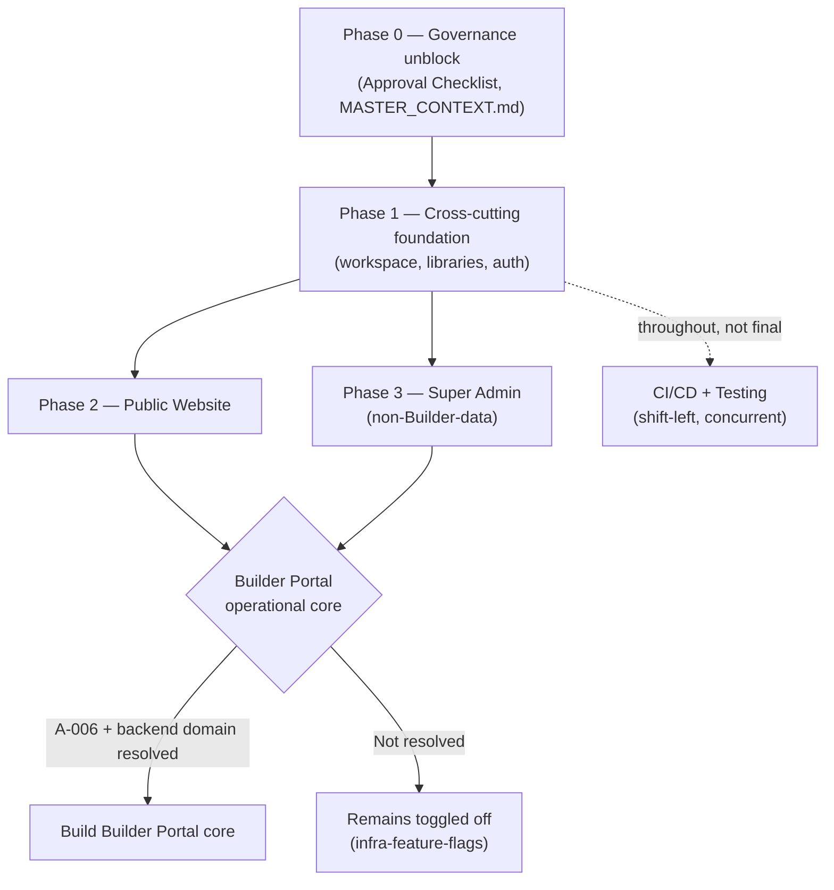
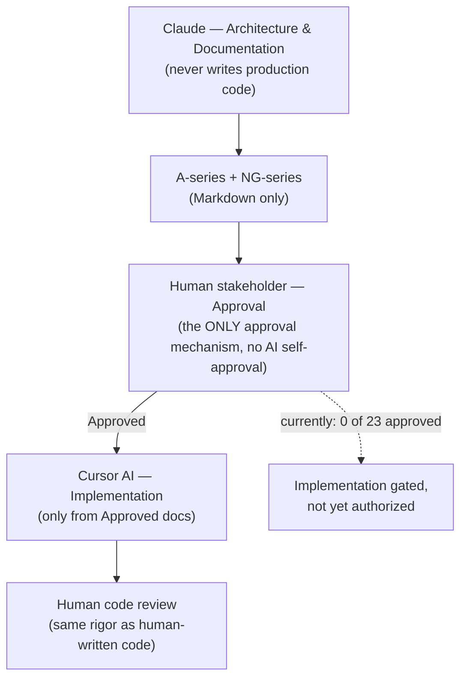

# NG-014 — Review Diagrams

**Companion to:** [`../NG-014_Technical_Architecture_Review.md`](../NG-014_Technical_Architecture_Review.md)

---

## 1. Architecture Dependency Graph

---

## 2. Business → Technical Traceability

```mermaid
flowchart LR
    subgraph Business["Business Architecture"]
        direction TB
        BV["Vision"] --> BF["Flow"] --> UJ["Journey"] --> US["Stories"] --> SF["Screens"] --> NAV["Navigation"]
        NAV -.gap.-> FM["Functional Modules — MISSING"]
        FM -.bridged.-> IA["Info Architecture"]
        IA --> RBAC["RBAC"]
    end
    subgraph Technical["Technical Architecture"]
        direction TB
        AA["Angular Arch"] --> WS["Workspace"] --> LIB["Libraries"] --> RT["Routing"] --> ST["State"] --> AUTH["Auth"] --> API["API"] --> FS["Folders"] --> PERF["Performance"] --> LOG["Logging"] --> DEP["Deployment"] --> TEST["Testing"] --> PRES["Presentation"]
    end
    RBAC --> AA
```

---

## 3. Implementation Readiness Flow

---

## 4. Architecture Governance Model

---

## 5. Technical Dependency Diagram

```mermaid
flowchart LR
    NG000["NG-000 Governance"] --> NG001["NG-001 Angular Arch"]
    NG001 --> NG002["NG-002 Workspace"]
    NG002 --> NG003["NG-003 Libraries"]
    NG003 --> NG004["NG-004 Routing"]
    NG004 --> NG005["NG-005 State"]
    NG005 --> NG006["NG-006 Auth"]
    NG006 --> NG007["NG-007 API"]
    NG007 -.external.-> Backend["my_property_asset backend\n(3/10 domains specified)"]
    NG007 --> NG008["NG-008 Folders"]
    NG008 --> NG009["NG-009 Performance"]
    NG009 --> NG010["NG-010 Logging"]
    NG010 --> NG011["NG-011 Deployment"]
    NG011 --> NG012["NG-012 Testing"]
    NG012 --> NG013["NG-013 Presentation"]
    NG013 --> NG014["NG-014 This Review"]
```

